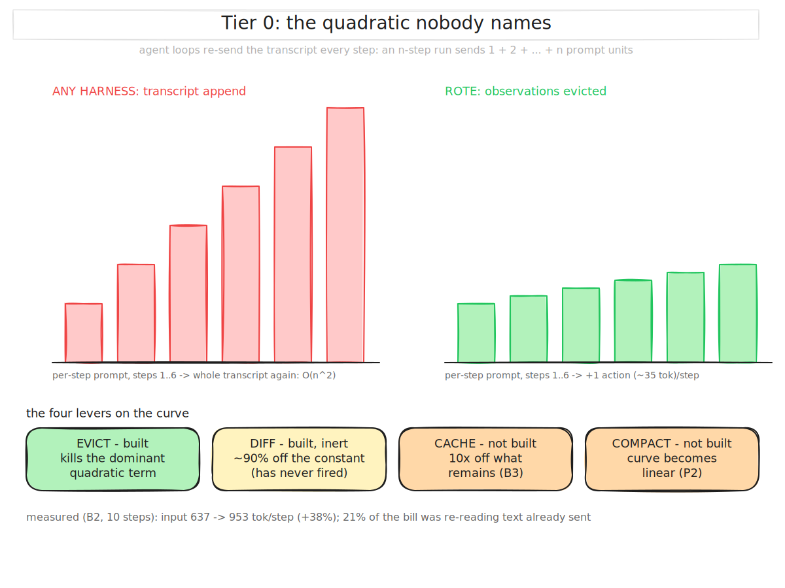
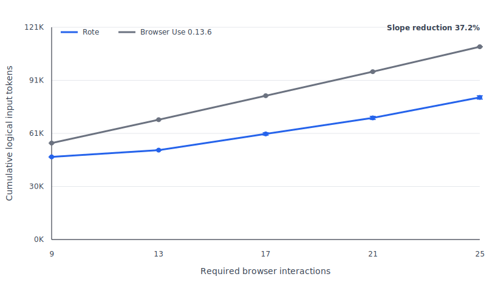
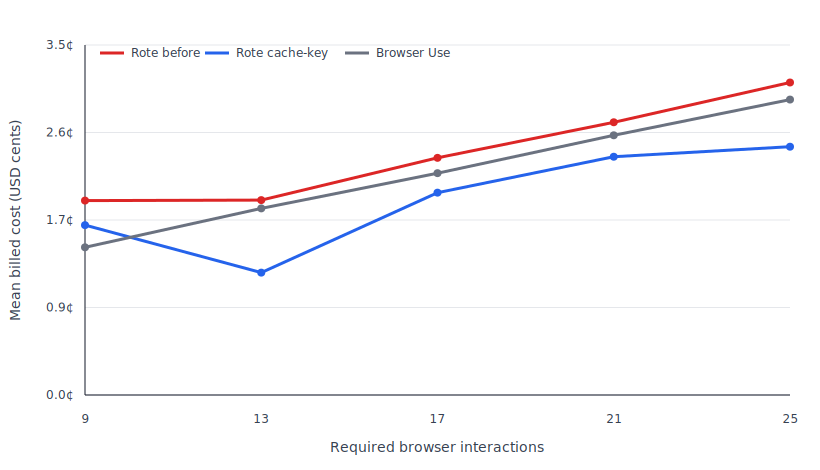
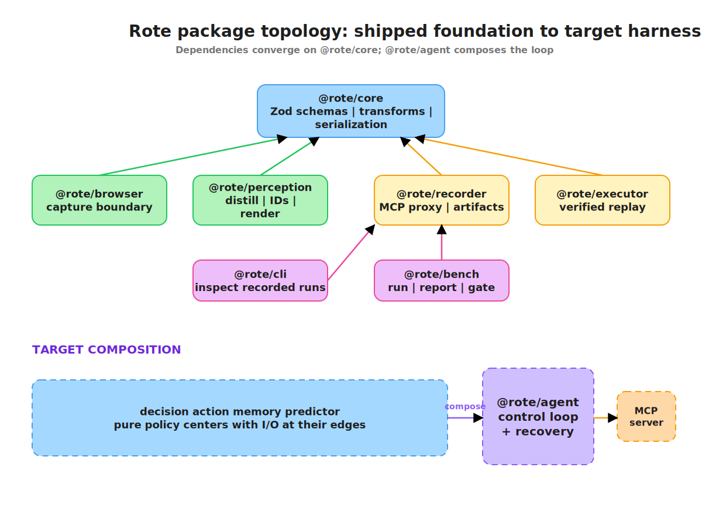

<div align="center"><pre>
 ____        _       
|  _ \ ___  | |_ ___ 
| |_) / _ \ | __/ _ \
|  _ < (_) || ||  __/
|_| \_\___/  \__\___|
</pre>

**The memory manager for browser agents.**
Every harness has memory. None of them manages it.

</div>

---

## The one-liner

> **Agent harnesses have no memory manager. Rote is the memory manager.**

Browser agents forget at three timescales, and pay again at every one. Rote treats the
context window as a managed resource: a budget, an eviction policy, a layout contract, and
a trust gate on the way back in.

## The problem

A typical browser agent loop is expensive and serialized:

```text
observe page → model thinks → act → wait → observe again
```

And it re-sends its whole transcript every step. A run of *n* steps sends `1 + 2 + … + n`
prompt-units, so **cost is O(n²) in task length**. Measured on our own runs, input tokens
climb every step:

```
B2 (10 steps):  637 → 677 → 716 → 759 → 800 → 839 → 876 → 917 → 953   (+38%)
```

**21% of that run's input bill is re-reading text it already sent** — on a page that
distills to 10 nodes. Everything the field competes on (DOM serializers, element filtering,
vision-vs-a11y) shrinks the *per-step* prompt. That lowers the constant. Nobody has touched
the exponent.



### The three amnesias

| Tier | Scope | What it forgets | The bill |
|---|---|---|---|
| **0 — Working** | within a run | what it already sent this run | O(n²) in task length |
| **1 — Episodic** | across runs of a task | the procedure that worked yesterday | run #50 costs what run #1 cost |
| **2 — Semantic** | across tasks on a site | how the site behaves at all | every task re-learns the portal |

And the precondition: **memory that might be wrong is worse than no memory.** Every tier is
assertion-gated on the way back in — success is decided by page state, never by the absence
of an exception.

## What Rote does

Rote is a complete browser-agent harness with four efficiency planes (see
[docs/02](docs/02-architecture.md)):

1. **Perception** — capture pages through CDP, distill them into compact interactive trees,
   assign stable element IDs, and send diffs instead of full page dumps when possible.
2. **Decision** — own the context layout, route routine steps to cheaper models, and skip
   model calls entirely when memory/replay can safely act.
3. **Action** — use typed browser actions, settledness detection, self-healing element
   resolution, per-step assertions, and later speculative pre-execution.
4. **Learning** — record every run, learn playbooks/site memory/transition models, and feed
   that knowledge back into replay, hints, resolution, and prediction.

The first launch target is intentionally narrow and measurable:

```text
same browser tasks as Browser Use → fewer tokens → success parity → raw benchmark data
```

## Measured working-memory curve

Across 15 independently reset runs per harness/checkpoint on a real WordPress page,
Rote's cumulative logical-input curve grows **37.2% more slowly than Browser Use 0.13.6**
(95% seeded-bootstrap CI: **35.6–38.8%**), with 75/75 verified successes on each side.
Logical input counts uncached + cache-read + cache-write tokens, so provider caching cannot
masquerade as memory reduction.



At 25 required interactions, Rote uses 26.3% fewer logical-input tokens. In this frozen
pre-cache-key matrix, that is not a cost or latency win: Browser Use receives more
discounted cache reads, so Rote's mean bill is 5.4% higher and p50 latency 6.4% higher. G1 proves slower logical
context growth, not cheaper execution under today's prompt-cache economics.

[Method and full table](docs/testing/T10-g1-cumulative-token-curve.md) ·
[Rote JSONL](docs/testing/data/T10-v8-certification-rote.jsonl) ·
[Browser Use raw receipts](docs/testing/data/T10-v8-certification-browser-use-raw.jsonl) ·
[normalized Browser Use JSONL](docs/testing/data/T10-v8-certification-browser-use.jsonl) ·
[machine-readable summary](docs/testing/data/T10-g1-curve-summary.json)

### Cache economics follow-up

After freezing G1, Rote began sending a SHA-256-derived `prompt_cache_key` for the exact
immutable planner prefix. A fresh, identically ordered 15-run paired matrix preserves the
logical curve (37.6% slower growth) while moving more of Rote's prompt into OpenAI's
discounted cache bucket:



At WP-N25, mean Rote cost falls **20.5%** (95% CI: 11.3–30.3%) and is **16.0% lower than
Browser Use** (95% CI: 6.2–26.2%). The shortest WP-N09 cell still loses cost and its
comparison interval crosses parity; this is a long-task cache win, not a universal one.
Logical tokens are never relabeled as savings.

[Cache method and table](docs/testing/T11-cache-key-economics.md) ·
[optimized curve](docs/testing/T11-cache-key-optimized-curve.md) ·
[optimized Rote JSONL](docs/testing/data/T11-cache-key-v1-rote.jsonl) ·
[Browser Use raw receipts](docs/testing/data/T11-cache-key-v1-browser-use-raw.jsonl) ·
[cache summary](docs/testing/data/T11-cache-key-economics-summary.json)

### Tokens-per-task level

On the frozen B1–B3 deterministic suite, Rote and Browser Use each passed **54/54**
independently verified attempts. Rote reduced logical tokens per completed task by
**91.8% on B1** (95% CI 91.8–91.9%), **77.3% on B2** (76.9–78.1%), and **93.3% on B3**
(92.4–93.9%). The matched-repetition intervals all clear the formal positive-margin G2
gate. B2 does **not** clear the benchmark catalog's 80% target, so these results are not
an “80%+ on every task” claim.

These are controlled local fixtures, while G1 is the real-WordPress length result. They
do not establish production-site, learned-memory, or cross-provider wins.

[G2 method, audit, and raw evidence](docs/testing/T13-g2-certification.md) ·
[machine summary](docs/testing/data/T13-g2-summary.json)


## Design invariants

1. **Never silently wrong** — every replayed step is assertion-gated; a final verify block
   must pass or the run escalates the repair ladder.
2. **Never worse than baseline** — full-agent fallback always exists. A Rote miss costs one
   cheap match call.
3. **Never cross environments** — a structural fingerprint (tool inventory, target-system
   identity) is a hard gate. A playbook learned on staging can't fire on prod.
4. **Everything versioned** — playbooks and repair patches are append-only, auditable,
   diffable, and exportable as human-readable YAML.

## Why "Rote"

*Rote*: doing something from memory, by repetition, without re-deriving it. For browser
agents, that means the harness remembers how sites behave — observations, stable elements,
procedures, and verification signals — so the next run starts warmer.

## Status

**Early build — G1 and G2 pass; the launch package remains.**

Built and working end to end: core schemas + Expect DSL, lossless recorder, verified
replay executor, CDP browser backend, perception (distill → stable IDs → budget),
**observation eviction**, the agent loop, tagged LLM accounting, and the benchmark +
head-to-head gate. First live run against a real browser and model
([T1](docs/testing/T1-openai-dry-run.md)) completed B1 in the minimum four actions; B2 now
passes 11/11 after [#49](https://github.com/kedarvartak/rote/issues/49).

We are in **P1 = tier 0, working memory**. Its four levers, honestly:

| Lever | State |
|---|---|
| Observation eviction — keep what you did, not what you saw | **built** (and never claimed until now) |
| Diff observations | **built and real-page measured** — 849 certification diffs have a 24-character median; median reduction vs. the preceding grounded base is 99.6% ([T10](docs/testing/T10-g1-cumulative-token-curve.md)) |
| Cache layout | **built and economically qualified** — immutable-prefix routing cuts WP-N25 mean cost 20.5% and clears Browser Use by 16.0%, both with 95% intervals above zero ([T11](docs/testing/T11-cache-key-economics.md)) |
| History compaction | not built — the lever that would make the curve linear rather than a smaller quadratic |

Not built: the playbook distiller (V1 replays hand-written playbooks), the matcher, site
memory, model routing, speculation. **Tier 1 is table stakes and we are late to it** —
Skyvern ships record → codegen → zero-LLM replay → fallback today
([docs/04](docs/04-competition.md)). `docs/02-architecture.md` §Status is authoritative.

**No number, no launch.** G1 passes its public 30% slope-reduction floor: 37.2%
(95% CI 35.6–38.8%) at success parity. G2 also passes its positive-margin level gate on
B1–B3, though B2 misses the catalog's 80% target and cache economics still lose at G1's
shortest cell. Packaging, a clean-machine quickstart, demo, and limitations publication
still block launch.



Solid packages exist today; dashed packages are the target composition described in
[docs/02 — Architecture](docs/02-architecture.md).

## Docs

| Doc | Contents |
|---|---|
| [01 — Problem](docs/01-problem.md) | Why agents re-derive everything; the reuse-path gap; where Rote fits and where it doesn't |
| [02 — Architecture](docs/02-architecture.md) | **What is built vs designed**; the four planes; control loop; playbooks; repair ladder; memory; speculation; invariants |
| [03 — Benchmark](docs/03-benchmark.md) | Task suite, metrics, fairness rules, the variance rule, the launch gate, generalization |
| [04 — Competition](docs/04-competition.md) | The field, per-competitor teardown, capability matrix, steelmanned objections |
| [05 — Roadmap](docs/05-roadmap.md) | Where we are; V1 scope and gates; P0–P5; open questions |
| [06 — Optimizations](docs/06-optimizations.md) | The master catalog: every optimization, tier, status, evidence |
| [07 — Execution plan](docs/07-execution-plan.md) | The work breakdown: epics, tasks, dependencies, acceptance criteria, RAID |
| [testing/](docs/testing/) | Records of tests against real Rote — live browser, live model, live key |

## Contributing

See [CONTRIBUTING.md](CONTRIBUTING.md) for the dev workflow and PR conventions,
and [CLAUDE.md](CLAUDE.md) for the full engineering ruleset. Please also read
our [Code of Conduct](CODE_OF_CONDUCT.md). Found a security issue? See
[SECURITY.md](SECURITY.md) — please don't file it as a public issue.

## License

MIT — see [LICENSE](LICENSE).
