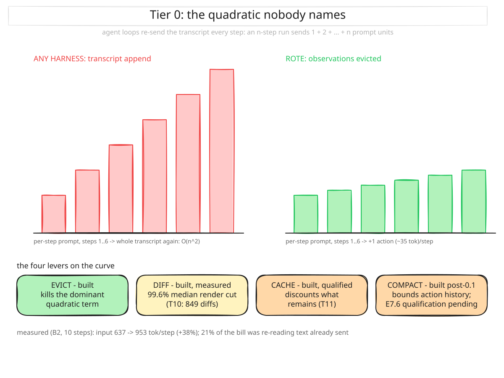
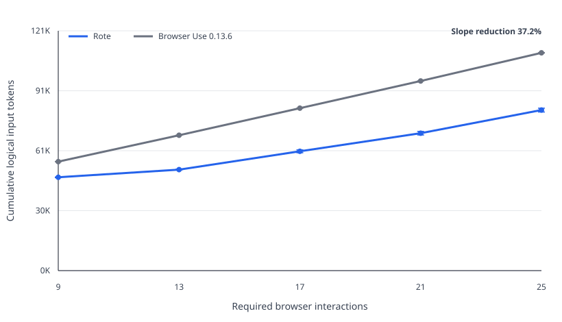
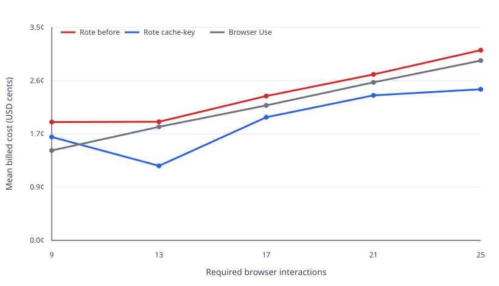
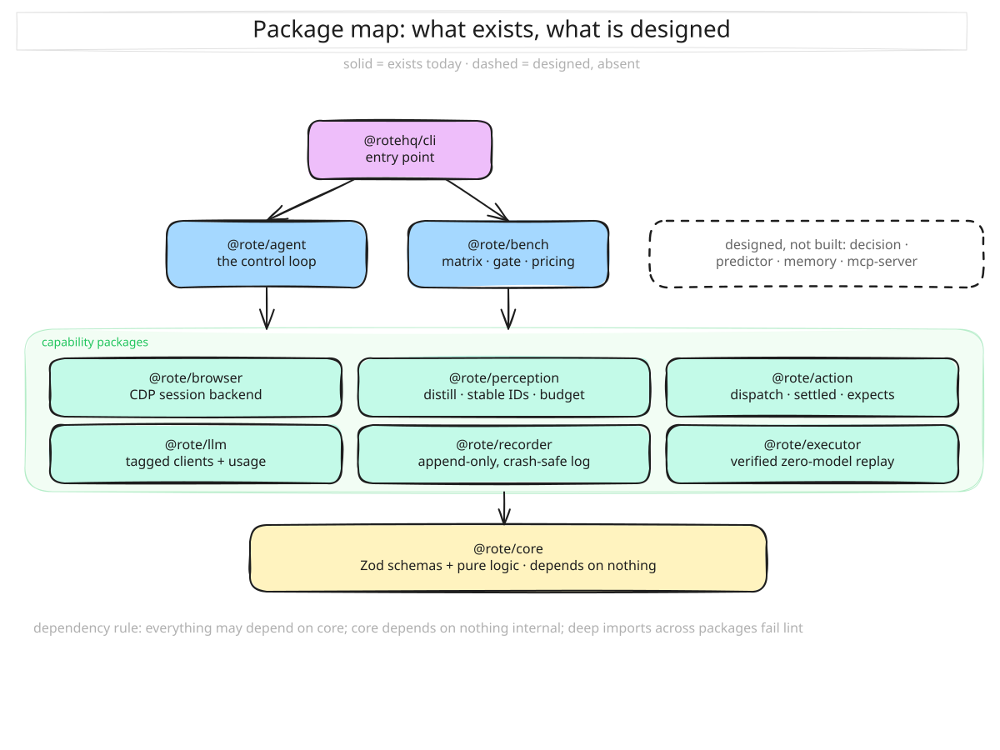

<div align="center"><pre>
 ____        _       
|  _ \ ___  | |_ ___ 
| |_) / _ \ | __/ _ \
|  _ < (_) || ||  __/
|_| \_\___/  \__\___|
</pre>

**The memory manager for browser agents.**
Every harness has memory. None of them manages it.

</div>

---

## The one-liner

> **Agent harnesses have no memory manager. Rote is the memory manager.**

Browser agents forget at three timescales, and pay again at every one. Rote treats the
context window as a managed resource: a budget, an eviction policy, a layout contract, and
a trust gate on the way back in.

## Quickstart

Prerequisites: Node 20+, Chrome/Chromium, and an OpenAI key.

```bash
export OPENAI_API_KEY=...
npx --yes @rotehq/cli@0.1.0 run \
  "Confirm that the page says Rote quickstart ready." \
  --url 'data:text/html,<h1>Rote quickstart ready</h1>' \
  --verify-text 'Rote quickstart ready' \
  --model gpt-4.1-mini --max-steps 3
```

The data URL is a local smoke. Only automate pages you are authorized to use, and provide
an independent terminal-state verifier. See [T28](docs/testing/T28-registry-provider-quickstart.md)
for the frozen empty-directory registry run.

## The problem

A typical browser agent loop is expensive and serialized:

```text
observe page → model thinks → act → wait → observe again
```

And it re-sends its whole transcript every step. A run of *n* steps sends `1 + 2 + … + n`
prompt-units, so **cost is O(n²) in task length**. Measured on our own runs, input tokens
climb every step:

```
B2 (10 steps):  637 → 677 → 716 → 759 → 800 → 839 → 876 → 917 → 953   (+38%)
```

**21% of that run's input bill is re-reading text it already sent** — on a page that
distills to 10 nodes. Everything the field competes on (DOM serializers, element filtering,
vision-vs-a11y) shrinks the *per-step* prompt, and the better harnesses now evict old
observations too. What no major harness ships is the next step: stop re-sending the
current page in full when a 24-character diff describes what changed
([04 — Competition](docs/04-competition.md), source-surveyed 2026-07-25).



### The three amnesias

| Tier | Scope | What it forgets | The bill |
|---|---|---|---|
| **0 — Working** | within a run | what it already sent this run | O(n²) in task length |
| **1 — Episodic** | across runs of a task | the procedure that worked yesterday | run #50 costs what run #1 cost |
| **2 — Semantic** | across tasks on a site | how the site behaves at all | every task re-learns the portal |

And the precondition: **memory that might be wrong is worse than no memory.** Every tier is
assertion-gated on the way back in — success is decided by page state, never by the absence
of an exception.

## What Rote does

Rote is a complete browser-agent harness with four efficiency planes (see
[docs/02](docs/02-architecture.md)):

1. **Perception** — capture pages through CDP, distill them into compact interactive trees,
   assign stable element IDs, and send diffs instead of full page dumps when possible.
2. **Decision** — own the context layout, route routine steps to cheaper models, and skip
   model calls entirely when memory/replay can safely act.
3. **Action** — use typed browser actions, settledness detection, self-healing element
   resolution, per-step assertions, and later speculative pre-execution.
4. **Learning** — record every run, learn playbooks/site memory/transition models, and feed
   that knowledge back into replay, hints, resolution, and prediction.

The P1 launch target was intentionally narrow and measurable:

```text
same browser tasks as Browser Use → fewer tokens → success parity → raw benchmark data
```

## Measured working-memory curve

Across 15 independently reset runs per harness/checkpoint on a real WordPress page,
Rote's cumulative logical-input curve grows **37.2% more slowly than Browser Use 0.13.6**
(95% seeded-bootstrap CI: **35.6–38.8%**), with 75/75 verified successes on each side.
Logical input counts uncached + cache-read + cache-write tokens, so provider caching cannot
masquerade as memory reduction.



At 25 required interactions, Rote uses 26.3% fewer logical-input tokens. In this frozen
pre-cache-key matrix, that is not a cost or latency win: Browser Use receives more
discounted cache reads, so Rote's mean bill is 5.4% higher and p50 latency 6.4% higher. G1 proves slower logical
context growth, not cheaper execution under today's prompt-cache economics.

[Method and full table](docs/testing/T10-g1-cumulative-token-curve.md) ·
[Rote JSONL](docs/testing/data/T10-v8-certification-rote.jsonl) ·
[Browser Use raw receipts](docs/testing/data/T10-v8-certification-browser-use-raw.jsonl) ·
[normalized Browser Use JSONL](docs/testing/data/T10-v8-certification-browser-use.jsonl) ·
[machine-readable summary](docs/testing/data/T10-g1-curve-summary.json)

### Cache economics follow-up

After freezing G1, Rote began sending a SHA-256-derived `prompt_cache_key` for the exact
immutable planner prefix. A fresh, identically ordered 15-run paired matrix preserves the
logical curve (37.6% slower growth) while moving more of Rote's prompt into OpenAI's
discounted cache bucket:



At WP-N25, mean Rote cost falls **20.5%** (95% CI: 11.3–30.3%) and is **16.0% lower than
Browser Use** (95% CI: 6.2–26.2%). The shortest WP-N09 cell still loses cost and its
comparison interval crosses parity; this is a long-task cache win, not a universal one.
Logical tokens are never relabeled as savings.

[Cache method and table](docs/testing/T11-cache-key-economics.md) ·
[optimized curve](docs/testing/T11-cache-key-optimized-curve.md) ·
[optimized Rote JSONL](docs/testing/data/T11-cache-key-v1-rote.jsonl) ·
[Browser Use raw receipts](docs/testing/data/T11-cache-key-v1-browser-use-raw.jsonl) ·
[cache summary](docs/testing/data/T11-cache-key-economics-summary.json)

### Tokens-per-task level

The frozen v1 matrix supports **91.8% lower logical tokens on B1** (95% CI 91.8–91.9%)
and **93.3% on B3** (92.4–93.9%) at independently verified parity. Its historical B2
estimate was withdrawn because the oracle proved only generic completion. A fresh
protocol-v2 matrix now independently proves all eight requested values and reduces B2
logical tokens by **83.6%** (95% CI 82.7–84.6%) at 18/18 success per harness.

These are controlled local fixtures, while G1 is the real-WordPress length result. They
do not establish production-site, learned-memory, or cross-provider wins.

[Historical G2 method and correction](docs/testing/T13-g2-certification.md) ·
[B2 exact-verification correction](docs/testing/T19-b2-exact-verification.md) ·
[corrective B2 certification](docs/testing/T20-b2-exact-certification.md)

### Deterministic drift recovery

On 90 real-Chrome B5 attempts, Rote recovered **72/72** selector-drifted replays without
an LLM or full fallback (100%, 95% Wilson interval 94.9–100.0%), observed **0/90** silent
failures, and failed closed on **18/18** ambiguous-control attempts. Repair used 0 logical
tokens versus an 8,354-token corrected B2 cold baseline. This covers semantic target
resolution, not arbitrary workflow repair or rollback.

[B5 method, limitations, and raw receipts](docs/testing/T21-b5-drift-certification.md) ·
[multi-harness comparison plan](docs/competitor-expansion-plan.md)

### Competitor expansion status

The first Stagehand feasibility cell was stopped rather than success-hunted: pinned
Stagehand 3.7.1 reached the exact B2 oracle on 1/6 cold attempts despite declaring 6/6
successes, and its public diagnostics did not retain complete raw cold-provider receipts.
The sole warm/drift pair is retained as diagnostic evidence, not a comparative rate or cost claim. Pinned Skyvern 1.0.47 then generated reusable artifacts and completed every non-abandoned B2/B5 qualification attempt exactly, but every completed warm/drift run triggered AI fallback and its self-hosted logs did not provide complete raw provider receipts. T23 therefore stops before comparative token/cost certification; it is not a Rote superiority claim. Browser Use 0.13.7 subsequently passed bounded T24 feasibility—3/3 corrected B2 cold attempts and 5/5 B5 cold diagnostics, all with complete receipts. T25 then recollected both harnesses in 18 fresh ordered corrected-B2 pairs: both passed 18/18 exact attempts, while Rote reduced logical tokens by 83.1% (95% CI 82.1–83.9%), billed cost by 68.2% (66.3–69.9%), and latency by 43.6% (39.0–48.1%). This is a single pinned local cold-agent cell; it does not test replay or learning. Magnitude 0.3.1 then stopped at bounded feasibility in T27: 0/6 corrected-B2 attempts reached a harness conclusion or exact oracle before the frozen 90-second timeout, and 0/6 retained complete raw provider receipts. No B5 run or Magnitude-vs-Rote ranking followed.

[Stagehand method and stop decision](docs/testing/T22-stagehand-qualification.md) · [Skyvern method and stop decision](docs/testing/T23-skyvern-qualification.md) · [Browser Use refresh qualification](docs/testing/T24-browser-use-0137-qualification.md) · [Browser Use 0.13.7 paired certification](docs/testing/T25-browser-use-0137-paired-certification.md) · [Magnitude method and stop decision](docs/testing/T27-magnitude-qualification.md)

### Reproduce and watch

Reproduce the historical v1 report byte-for-byte (this preserves the record; it does not
restore the withdrawn B2 claim):

```bash
npm ci
npm run reproduce:g2
npm run reproduce:b5
npm run reproduce:stagehand
npm run reproduce:skyvern
npm run reproduce:browser-use-refresh
npm run reproduce:browser-use-0137-certification
npm run reproduce:post-action-evidence
npm run reproduce:magnitude
```

The paid 18-repetition collection is also one resumable command; see the
[head-to-head runbook](scripts/bench/headhead/README.md). To watch the current product
boundary—cold exploration, explicit zero-token replay, then selector drift detected and
sent to the plain agent—open the [terminal recording](docs/demo/launch-demo.cast) or run:

```bash
export OPENAI_API_KEY=...
scripts/demo/run-launch-demo.sh
```

The candidate in this demo is hand-written, not learned, and drift uses full fallback,
not scoped repair. [Method and raw demo artifacts](docs/testing/T16-launch-demo.md).

To see why a full cosmetic redesign costs ~6 tokens while a real change still
surfaces — the production distiller and adaptive renderer on three versions of one
page, no API key needed — run:

```bash
npx tsx scripts/demo/cosmetic-diff-demo.ts
```

Edit the HTML inside the script to try your own drift.


## Design invariants

1. **Never silently wrong** — every replayed step is assertion-gated; a final verify block
   must pass or the run escalates the repair ladder.
2. **Never worse than baseline** — a mismatched, failed, or errored explicit replay returns
   to the plain agent with a recorded classification. Generic rollback of prior server-side
   effects is not built.
3. **Never cross environments** — a structural fingerprint (tool inventory, target-system
   identity) is a hard gate. A playbook learned on staging can't fire on prod.
4. **Everything versioned** — playbooks and repair patches are append-only, auditable,
   diffable, and exportable as human-readable YAML.

## Why "Rote"

*Rote*: doing something from memory, by repetition, without re-deriving it. For browser
agents, that means the harness remembers how sites behave — observations, stable elements,
procedures, and verification signals — so the next run starts warmer.

## Status

**Early build — G1, corrected G2, and deterministic B5 drift gates pass.**

Built and working end to end: core schemas + Expect DSL, lossless recorder, verified
replay executor, CDP browser backend, perception (distill → stable IDs → budget),
**observation eviction**, the agent loop, tagged LLM accounting, and the benchmark +
head-to-head gate. First live run against a real browser and model
([T1](docs/testing/T1-openai-dry-run.md)) completed B1 in the minimum four actions; B2 now
passes 11/11 after [#49](https://github.com/kedarvartak/rote/issues/49).

**P1 tier-0 working memory launched on 2026-08-08; P2 is current.** The four tier-0 levers, honestly:

| Lever | State |
|---|---|
| Observation eviction — keep what you did, not what you saw | **built and recall-stress tested** — missing earlier-page facts fail as `recall_unavailable`; fabricated comparisons fail verification ([T18](docs/testing/T18-eviction-recall-trade.md)) |
| Diff observations | **built and real-page measured** — 849 certification diffs have a 24-character median; median reduction vs. the preceding grounded base is 99.6% ([T10](docs/testing/T10-g1-cumulative-token-curve.md)) |
| Cache layout | **built and economically qualified** — immutable-prefix routing cuts WP-N25 mean cost 20.5% and clears Browser Use by 16.0%, both with 95% intervals above zero ([T11](docs/testing/T11-cache-key-economics.md)) |
| History compaction | **built deterministically on `main`; long-run qualification pending** — planner-visible action history is bounded on cache-amortized boundaries, but the frozen P1 curve and published 0.1.0 predate it |

Not built: the playbook distiller (V1 replays hand-written playbooks), the matcher, site
memory, model routing, speculation. **Tier 1 is table stakes and we are late to it** —
Skyvern ships record → generated code → code replay with automatic AI fallback today; its documented zero-reasoning path must not be assumed for every generated artifact ([docs/04](docs/04-competition.md)). `docs/02-architecture.md` §Status is authoritative.

**No number, no launch was enforced.** G1 passes its public 30% slope-reduction floor: 37.2%
(95% CI 35.6–38.8%) at success parity. B1/B3 retain their original level evidence and T20 restores B2/full G2 with an exact
eight-value oracle. Cache economics still
lose at G1's shortest cell. The CLI tarball, demo, and one-command reproduction pass;
`@rotehq/cli@0.1.0` is registry-published. Its audited integrity, clean no-key bin invocation, and provider-backed empty-directory quickstart pass; [T28](docs/testing/T28-registry-provider-quickstart.md) retains the exact manifest, trajectory, and raw receipt. Read the [known limitations](docs/known-limitations.md) before trying Rote and see
[T14](docs/testing/T14-cli-package-candidate.md) for packaging evidence.



Solid packages exist today; dashed packages are the target composition described in
[docs/02 — Architecture](docs/02-architecture.md).

## Docs

| Doc | Contents |
|---|---|
| [01 — Problem](docs/01-problem.md) | Why agents re-derive everything; the reuse-path gap; where Rote fits and where it doesn't |
| [02 — Architecture](docs/02-architecture.md) | **What is built vs designed**; the four planes; control loop; playbooks; repair ladder; memory; speculation; invariants |
| [03 — Benchmark](docs/03-benchmark.md) | Task suite, metrics, fairness rules, the variance rule, the launch gate, generalization |
| [04 — Competition](docs/04-competition.md) | The field, per-competitor teardown, capability matrix, steelmanned objections |
| [05 — Roadmap](docs/05-roadmap.md) | Where we are; V1 scope and gates; P0–P5; open questions |
| [06 — Optimizations](docs/06-optimizations.md) | The master catalog: every optimization, tier, status, evidence |
| [07 — Execution plan](docs/07-execution-plan.md) | The work breakdown: epics, tasks, dependencies, acceptance criteria, RAID |
| [Launch readiness](docs/launch-readiness.md) | Final P1 gate walk, sole registry blocker, and exact release-closure procedure |
| [Known limitations](docs/known-limitations.md) | What is not built, weak-fit tasks, safety/operations boundaries, and the exact evidence scope |
| [Third-party licenses](docs/third-party-licenses.md) | CLI and benchmark dependency/fork review plus release obligations |
| [testing/](docs/testing/) | Records of tests against real Rote — live browser, live model, live key |

## Contributing

See [CONTRIBUTING.md](CONTRIBUTING.md) for the dev workflow and PR conventions,
and [CLAUDE.md](CLAUDE.md) for the full engineering ruleset. Please also read
our [Code of Conduct](CODE_OF_CONDUCT.md). Found a security issue? See
[SECURITY.md](SECURITY.md) — please don't file it as a public issue.

## License

MIT — see [LICENSE](LICENSE).
