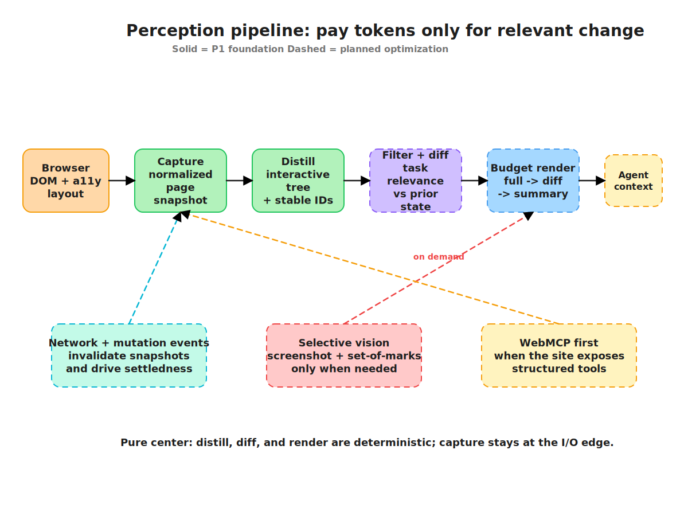
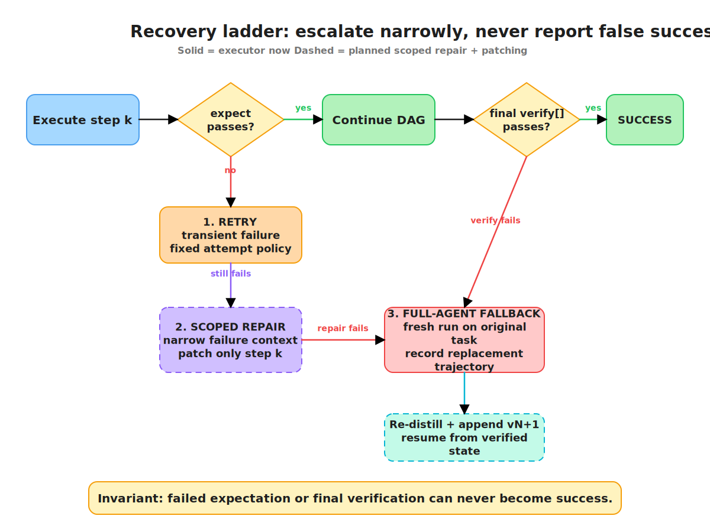
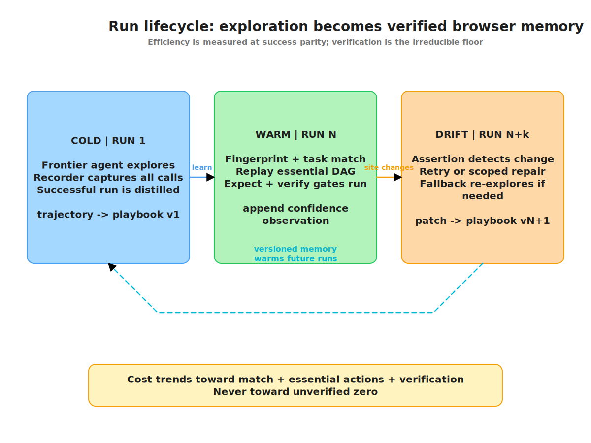

# 02 — Architecture


## Design thesis

> **Agent harnesses have no memory manager. Rote is the memory manager.**
>
> Corollary: control flow should be deterministic. The model's job is content and repair,
> not navigation.

A successful run tangles two things together: *what to do* (the procedure) and *what to
say/fill/decide* (the content). Rote untangles them. The procedure becomes a
deterministic, replayable artifact; the model is invoked only where genuine judgment
lives — binding parameters, filling slots, repairing broken steps.

Rote is a **complete browser-agent harness**, not middleware. Every optimization that
matters lives inside the loop — what the model sees, when it's called, which model, how
actions are grounded — and a layer at the tool boundary can advise but cannot restructure
the loop. Rote's tools are still exposed over MCP, so the same codebase can be *driven
by* another client; the harness and the layer are two entry points, not two products.

### The memory spine

Everything below hangs off one idea. The context window is **memory**, and memory needs a
manager: a budget, an eviction policy, a write path, and a trust gate on the way back in.
No shipping harness has one — they append to a transcript and hope
([04](04-competition.md)).

Three tiers, three timescales, one disease at each: the agent forgets, re-derives, pays
again ([01](01-problem.md)).

| Tier | Scope | Answers | Mechanism | Where |
|---|---|---|---|---|
| **0 — Working** | one run | "what am I looking at, what have I done" | evict observations, diff, budget, cache layout, compact | perception + decision planes |
| **1 — Episodic** | runs of one task | "how did this go last time" | record → distill → playbook → verified replay → repair | learning plane |
| **2 — Semantic** | tasks on one site | "how does this site behave" | site brief, selector maps, settle priors, quirks | learning plane |

The operating-system reading is exact, and worth holding: the context window is RAM,
observations are pages, dropping them is eviction, diffing is delta encoding, the prompt
cache is L2, compaction is GC, a playbook is a cached compiled program, and site memory is
the persistent store. Every one of those has a manager in an OS. **None of them has one in
a browser agent.**

**The trust gate is not a fourth tier — it is the precondition for all three.** Memory that
might be wrong is worse than no memory (invariant 1). Reuse without verification is a
machine for repeating a mistake at volume.

## Status: what is built

**Read this table before believing anything below it.** Design and reality are easy to
confuse in an architecture doc; this is the boundary.

| Subsystem | Tier | State |
|---|---|---|
| Core schemas, Expect DSL, templating, fingerprinting | — | **built** |
| Recorder — append-only, crash-safe, fsync-per-event | 1 | **built** |
| Replay executor — verified, zero-model on hand-written playbooks | 1 | **built** |
| CDP browser backend, perception (distill → stable IDs → budget) | 0 | **built** |
| Agent loop, context assembler, tagged LLM client | 0 | **built** |
| Benchmark matrix, per-source accounting, head-to-head gate | — | **built** |
| Action plane: settledness, resolution chain, optional expect + scoped repair | — | **built** — [T1](testing/T1-openai-dry-run.md)'s expect defect fixed (#49/#50) |
| **Observation eviction** — keep actions, drop prior observations | 0 | **built** — the dominant quadratic term is already gone |
| **Diff observations** (A4) | 0 | **built but inert** — has never fired; fixtures are too small to trigger it |
| **Cache-layout discipline** (B3) | 0 | **not built** — the stable/volatile split exists, but no `cache_control` is ever sent. Its prerequisite, provider-normalized cache accounting, is **built** ([#57](https://github.com/kedarvartak/rote/issues/57)) |
| **History compaction** (B4) | 0 | **not built** — required to make the curve linear rather than a smaller quadratic |
| **Playbook distiller** (trajectory → playbook) | 1 | **not built** — V1 playbooks are hand-written |
| **Matcher** (semantic match + bind) | 1 | **not built** — fingerprint gate only |
| **Site memory, model routing, speculation** | 2 | **not built** — designed below |

Packages that exist: `core recorder executor bench cli browser perception action agent llm`.
Designed but absent: `decision predictor memory mcp-server`.

**Tier 0 is half-built and unmeasured.** Eviction works and was never claimed; diffing has
never run; caching still has no mechanism, though its accounting prerequisite now does
(#57). That is the V1 gap ([05](05-roadmap.md)).

## The four planes

The planes are *where code lives*; the memory tiers are *what it is for*. They cross.

| Plane | Baseline cost | Rote's answer | Serves tier | Status |
|---|---|---|---|---|
| **Perception** | 5–40K tokens/step, re-sent every step | distill → filter → diff → budget | 0 | built, except diff never fires |
| **Decision** | frontier model, every step, full context | cache-local layout; route down or skip the model | 0, 1 | **layout not built** — its accounting prerequisite is (#57); routing designed |
| **Action** | act → wait → observe, serialized | settledness, self-healing resolution, speculation | — | first two built |
| **Learning** | every run starts cold | recorded trajectories → playbooks → site memory | 1, 2 | recording + replay built |



## Tier 0 — working memory

The context window is a managed resource with a budget, an eviction policy, and a layout
contract. This is the tier where the exponent lives, and the only one where no competitor
is building ([04](04-competition.md)).

Per planner call today (`packages/agent/src/context.ts`):

| Segment | Size | Behavior |
|---|---|---|
| `stablePrefix` — instructions, task, action schema, expect guidance | ~268 tok | constant |
| `Current page: {title} \| {url}` | ~20 tok | constant |
| `Previous actions:` — one JSON action per prior step | **~35–40 tok/step** | **grows linearly** |
| `Compact observation ({mode})` | ~135 tok (B2) | constant per page, re-sent fresh |

Step *n* costs `268 + 20 + 40n + obs`, so the sum over *n* steps carries a `40·n(n+1)/2`
term. That term is the parabola. The measured +35 tok/step matches one action JSON exactly
— the arithmetic and the telemetry agree.

### The policy: keep what you did, not what you saw

The standard agent pattern is a chat transcript —
`[system, user(obs₁), assistant(act₁), user(obs₂), …]` — in which **every observation stays
in context forever**. At 5–40K tokens each, step 20 is a 100–800K token prompt. It is what
the chat API shape encourages, and it is the catastrophic form of the quadratic.

`assemblePlannerContext` does not do this. It sends the action history plus the **current
observation only**; prior observations are evicted. That is why growth is 35 tok/step and
not 135+ — **the measurement proves the policy**.

**The trade, stated plainly:** the model recalls what it *did*, not what it *saw*. Correct
for form-filling and navigation. It will fail on tasks whose answer lives in an evicted
observation — "compare prices across three products". A real limit
([01](01-problem.md) §fit), not a footnote.

### The four levers

| Lever | Effect on the curve | Status |
|---|---|---|
| **Evict observations** | kills the dominant quadratic term | **built** (A4-adjacent; never claimed) |
| **Diff the current observation** (A4) | −~90% on the constant, on real pages | **built, never fires** — budget 4000 chars, B2's observation is 537, so every render is `full` |
| **Prefix-cache `[stable][history]`** (B3) | 10× off the surviving quadratic term | **not built** — accounting prerequisite done (#57); see below |
| **Scheduled compaction** (B4) | history → O(1); curve → **linear** | not built (P2) |
| **Replay** (B2) | 0 steps, 0 tokens | needs the distiller (P2) |

### Caching: the claim is currently false

The action history is **append-only**, so `[stable][history]` is a growing prefix and the
observation already sits last. The structure is right; the mechanism is absent. No
`cache_control` breakpoints are ever sent — Anthropic requires them explicitly, so on
Anthropic there is **no caching at all**, regardless of how well-ordered the prompt is.

The accounting was also blind to it, and that is now fixed
([#57](https://github.com/kedarvartak/rote/issues/57)) — **the accounting had to land
before any caching work**, because the two providers mean opposite things by the same
field name:

> **Anthropic's `usage.input_tokens` EXCLUDES cache activity** — `cache_read_input_tokens`
> and `cache_creation_input_tokens` are siblings, so the true prompt size is their sum.
> **OpenAI's `usage.input_tokens` INCLUDES it** — `input_tokens_details` is a *breakdown*.

`@rote/llm` read only `input_tokens` on both, which broke in **opposite directions**
(measured live, 2026-07-17, `gpt-5.6-luna`, a ~4K prompt sent twice):

```
OpenAI cold: input_tokens=4027  cached=0     cache_write=4024
OpenAI warm: input_tokens=4027  cached=4024  cache_write=0
```

- **Anthropic** — reported input *collapses* when cached: a **fake token win** that never
  happened, published by the instrument we use to prove our efficiency claims.
- **OpenAI** — reported input *stays flat* at 4027: **no win visible at all**, and 4024
  cached tokens priced at the base rate instead of ~0.1×, **overstating** cost ~10× on the
  cached portion.

The same one-line bug would have made Rote look artificially cheap on one provider and
artificially expensive on the other, in the same benchmark. `TokenUsage` is now normalized
at the provider boundary onto one contract —
`input_tokens + cache_read_tokens + cache_write_tokens === the provider's true prompt size`,
with `input_tokens` always the uncached remainder — and property-tested against both shapes.

**Our fixtures still cannot exercise caching.** The minimum cacheable prefix is
*model-dependent*, not a flat 1024: **4096 tokens** on Opus 4.8/4.7/4.6/4.5 and Haiku 4.5,
2048 on Fable 5 and Sonnet 4.6, 1024 on Sonnet 4.5 and older. B2's per-call prompts are
637–953 — under every one of those. **Caching, if built today, would do nothing on our
benchmark**: the distiller made the prompts too small to cache. The win only appears on
real pages with real history, which is the same reason A4 has never fired.

### Caching and compaction fight

Caching requires the prefix to be immutable; compaction rewrites history to bound it.
Compact every step and you cache-miss every step — you have paid for both mechanisms and
bought neither. The resolution is amortization: compact on a schedule and eat one miss
every ~*k* steps. **Cache-economics-scheduled**, not step-scheduled.

### What is unproven

The curve has never been drawn against a competitor; "they're quadratic, we're linear" is
inference from architecture, not measurement. Rote is a *smaller-constant quadratic*, not
linear — linear needs compaction. Diffing's ~90% claim is untested at any real page size.
The eviction trade has never been stress-tested on a task requiring recall.

## The control loop

```ts
async function runTask(task: TaskSpec, deps: HarnessDeps): Promise<TaskResult> {
  const fp = await fingerprint(deps.session);          // invariant 3: hard gate
  const brief = deps.memory.brief(fp, task);           // site memory, ≤1K tokens  [planned]
  const ctx = ContextAssembler.init({ task, brief });  // owns cache layout

  const match = deps.memory.matchPlaybook(fp, task);   // [planned]
  if (match?.confidence >= TAU_REPLAY)
    return deps.executor.replay(match, task.params);   // zero model steps  [built]

  while (true) {
    await deps.action.settled(deps.session);                            // built
    const obs = await deps.perception.observe(deps.session, ctx.budget); // built
    ctx.push(obs);                                                       // diff-encoded

    const route  = deps.decision.route(ctx, deps.memory);   // [planned] → frontier today
    const action = await deps.decision.decide(route, ctx);  // structured output, built

    const outcome = await deps.action.dispatch(action, deps.session);   // built
    deps.recorder.record(outcome);                                      // always
    if (outcome.expect.some(failed)) {
      const recovered = await deps.recovery.ladder(outcome, ctx);       // [partial]
      if (!recovered) return failCleanly(outcome);                      // invariant 2
    }
    if (action.verb === 'done')
      return deps.verify.gate(task, ctx)   // invariant 1: no verify pass, no success
        ? success(action.result)
        : deps.recovery.escalate(task, ctx);
  }
}
```

**The ContextAssembler owns message layout** and is the only module allowed to reorder
them: immutable system prompt + tool schemas → session-stable site brief → compacted
history → live tail. Prompt-cache reads are ~10× cheaper and agent loops re-send the
whole transcript every step, so **hit rate ≈ spend**. Tests fail if any volatile token
(timestamp, run id) lands above the stable line.

## Type spine (Zod-first; types derived, never hand-written)

```ts
// perception
interface StableNodeId { hash: string }        // role + name + ancestry content hash
type Observation =
  | { kind: 'full';    page: PageIdentity; tree: DistilledNode[]; tokens: number }
  | { kind: 'diff';    page: PageIdentity; baseSeq: number; changes: NodeChange[] }
  | { kind: 'summary'; page: PageIdentity; text: string; expandable: Region[] };

// decision
type StepClass = 'replay' | 'speculated' | 'grounded-routine' | 'frontier' | 'recovery';

// action — a small closed verb set, not 50 overlapping tools
type Action =
  | { verb: 'navigate'; url: string }
  | { verb: 'click';  target: StableNodeId }
  | { verb: 'fill';   target: StableNodeId; value: string }
  | { verb: 'select'; target: StableNodeId; option: string }
  | { verb: 'extract'; query: ExtractQuery }
  | { verb: 'done'; result: unknown } | { verb: 'fail'; reason: string };

interface StepOutcome {
  action: Action; result: ToolResult;
  expect: ExpectVerdict[];
  timing: { settleMs: number; actMs: number; observeMs: number; thinkMs: number };
  tokens: PerSourceTokens;          // invariant 5: every call tagged
}
```

**Stable IDs are a schema-level commitment.** They appear in trajectories, playbooks, and
memory, which is what makes diffs (`"#e42 changed"` rather than re-listing the page) and
cross-run learning possible at all. Most harnesses renumber every step and silently break
history reuse.

## Playbooks

A playbook is a parameterized step DAG. Humans never author them — agents discover them —
but they export to readable YAML precisely so humans can audit them.

```yaml
playbook: submit-vendor-invoice
version: 3                       # patches bump versions; history kept
task_signature:
  env_fingerprint: {domain: vendors.acme.com, tools: [browser.*]}
params:
  - {name: invoice_id, type: string}
steps:
  - id: open_portal
    tool: browser.navigate
    args: {url: "https://vendors.acme.com/invoices"}
    expect: {selector_visible: "#invoice-table"}
    on_fail: repair              # repair | retry(n) | fallback
  - id: fill_amount
    tool: browser.fill
    args: {selector: "#amount", value: "{{amount}}"}     # slot
    expect: {input_value: "#amount", equals: "{{amount}}"}
verify:
  - {text_visible: "Invoice submitted"}
confidence: 0.94                 # updated every run
```

Three step kinds, deliberately minimal:

- **Deterministic** — tool + bound args. Zero model tokens.
- **Slot** — the model fills a value. Small, scoped, cheap-model-eligible.
- **Judgment gate** — a rare explicit branch, encoded as constrained classification, not
  free-form planning.

## Verification, and what T1 taught us

Every step carries a postcondition; the task carries a final `verify[]`. **Success is
only reported if verification passes** — invariant 1, and the anchor under every
efficiency claim (all benchmark numbers are *at success parity*).

[T1](testing/T1-openai-dry-run.md) found the live-agent version of this was
mis-designed: the action schema made `expect` **mandatory**, so the planner had to
predict the page's confirmation text before seeing it. It guessed plausibly and wrongly,
and correct runs were recorded as failures (B2: 0/7). Meanwhile the expects that *passed*
were largely tautological — asserting a value the model itself had just typed.

The lesson generalizes: **a model-authored postcondition about a future state is either a
guess or a tautology.** T1's B2 sharpened it further — the confirmation section is
`hidden` until submit and the distiller drops hidden nodes, so the post-click state was
not expressible in *any* primitive of the DSL. Text or selector alike, the model had
never seen it. Steering toward "structural" expects would only have moved the guess from
a string to an id.

**Resolved ([#49](https://github.com/kedarvartak/rote/issues/49),
[#50](https://github.com/kedarvartak/rote/issues/50)) — `expect` is now optional:**

1. The planner is told to **omit** rather than guess, and does: across live re-runs it
   omitted on every action of B1/B3/B2, so the tautologies disappeared too. Forcing the
   field was itself the cause of both failure shapes — a mandatory slot with nothing true
   to put in gets filled with an invention or a restatement.
2. A failed expect is no longer fatal. It buys **one scoped repair** (rung 2 below),
   because a failed assertion means the model's belief was wrong, not that the action
   was — on B2 the submit had already landed. Exhausting the budget is fatal.
3. Success still requires the independent final `verify` gate, authored against ground
   truth. That gate is what makes B1/B3/B2 successes real, and it never moved.

Result: B2 0/7 → **11/11** on `gpt-5.6-luna` and `gpt-5.6-sol`, at roughly neutral token
cost (B3 got ~1% *cheaper* — the output tokens saved by not emitting `expect` paid for
the prompt guidance). Deriving postconditions from the observation diff instead of
asking the model at all remains open as [#54](https://github.com/kedarvartak/rote/issues/54).

## Repair ladder



On assertion failure — never fail the task blindly, never silently continue:

1. **Retry** — transient (network, timing), per step policy.
2. **Scoped repair** — a model call with *narrow* context: the failing step, its expected
   postcondition, observed state, and the step's intent. It re-derives one step, emits a
   **patch**, replay resumes. Patches are additive and versioned; bad patches roll back,
   and patch history is itself a drift signal.
3. **Fallback** — full agent run, recorded, re-learned. Worst case equals not having Rote.

Cheap recovery is an efficiency feature: a scoped repair costs ~one step; a blind restart
costs the whole task.

## Tiers 1 and 2 — the learning plane (designed)

Three stores, in build order. They implement memory tiers 1 (episodic) and 2 (semantic);
the numbering below is the *store*, not the tier — see §The memory spine.

| Store | Tier | Content | Mode |
|---|---|---|---|
| **Playbook** | 1 | whole-task DAG, exact repeats | replay (contract: verified, zero-model) |
| **Subflow** | 1 | shared prefixes (login → dashboard) reused across tasks | replay with hand-off |
| **Site memory** | 2 | selector maps, form semantics, page graph, settle times, quirks | **advisory** — the agent stays in control |

The distinction matters: the tier-1 stores *execute*; tier 2 only *informs* (a ≤1K-token
brief, resolution hints, calibrated settle times). **Advisory memory can be wrong without
being dangerous** — the agent still observes and verifies. Executable memory cannot, which
is why only tier 1 is assertion-gated on replay.

Tier 2 also feeds tier 0: a site brief is working-memory content with a token budget, and
a brief at 5% utility is overhead, not memory ([03](03-benchmark.md) reports hint utility
for exactly this reason).

## Speculative execution (designed)

The loop is fully serialized: think → act → settle → observe → think. **While the model
thinks about step N, the predicted step N+1 can already be executing** in a shadow
context — promote on hit, discard on miss, never past the effect boundary. This needs an
action safety classifier (`pure-read` / `local-nav` / `local-write` / `external-effect`),
a session virtualizer, and a predictor over recorded runs. Research with blind draft
models reaches ~55% accuracy for ~20% latency; trajectory memory should predict warm
sites far better. Kill gate: ≥70% top-1 accuracy offline, before any systems work.

## Run economics



| | Cold (run 1) | Warm (run N) | Drift (run N+k) |
|---|---|---|---|
| Model in control loop | every step | never | one step |
| Tool calls | ~40 (incl. dead ends) | ~6 (essential only) | ~8 |
| Artifact | trajectory → playbook v1 | confidence++ | patch → v2 |

Illustrative, not measured — the measured numbers live in [03](03-benchmark.md) and
[testing/](testing/). The marginal cost of a memoized task trends toward the
**verification floor**: the price of proving the replay still holds. That floor is the
honest lower bound. You never reach zero, because trusting an unverified replay is how
you ship wrong answers.

## Invariants

1. **Never silently wrong** — every replayed step is assertion-gated; no path reports
   success on a failed check.
2. **Never worse than baseline** — full-agent fallback always reachable, and it logs
   *why* it fired.
3. **Never cross environments** — structural fingerprint is a hard gate. A playbook
   learned on staging cannot fire on prod.
4. **Everything versioned** — playbooks and patches are append-only, with rollback.
5. **Every model call is tagged** — `planner|matcher|slot|repair|verify|distill`, through
   one client wrapper. Untagged calls fail lint.

These bind the agent loop exactly as they bound the middleware design. They are not
negotiable under schedule pressure; see `CLAUDE.md`.

## What Rote is not

- **Not a workflow engine** — humans never author playbooks; agents discover them.
- **Not semantic memory** — Rote stores procedures, not facts. Pair with Mem0/Zep:
  they inject knowledge, Rote removes work.
- **Not compression** — orthogonal. Compression shrinks a step; Rote declines to run it.

Next: [03 — Benchmark](03-benchmark.md)
