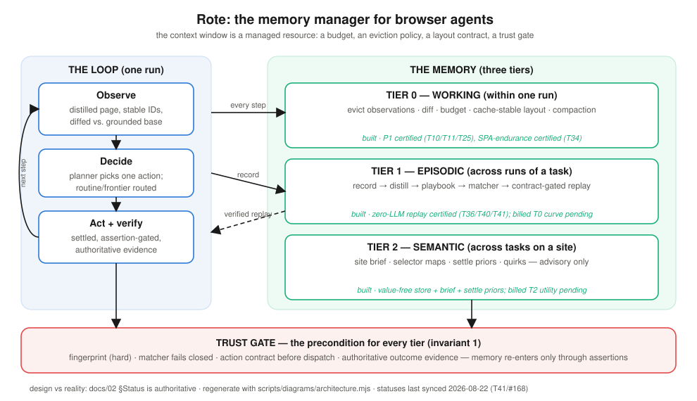
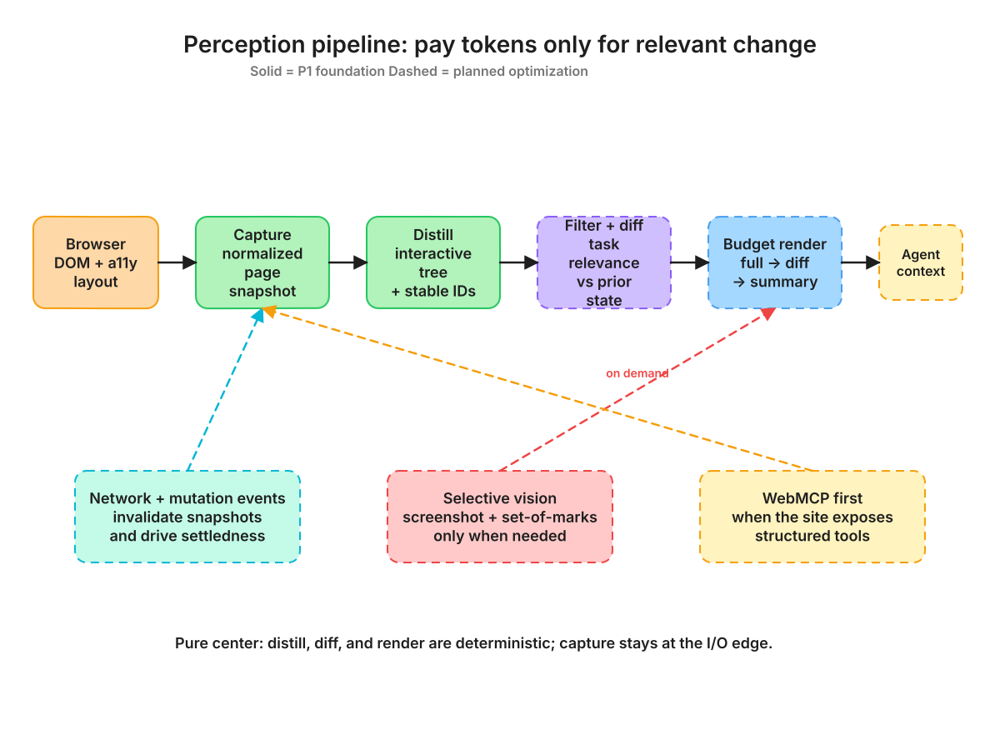
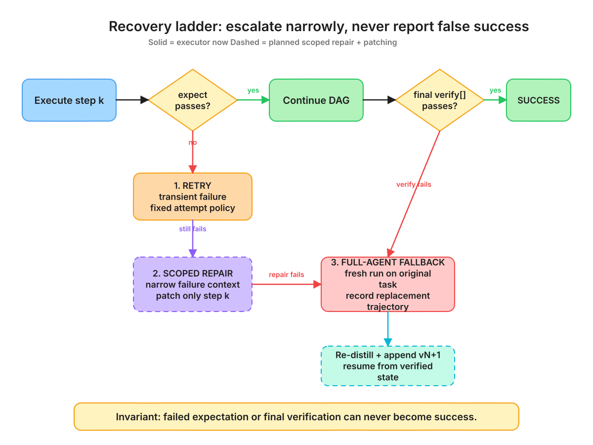
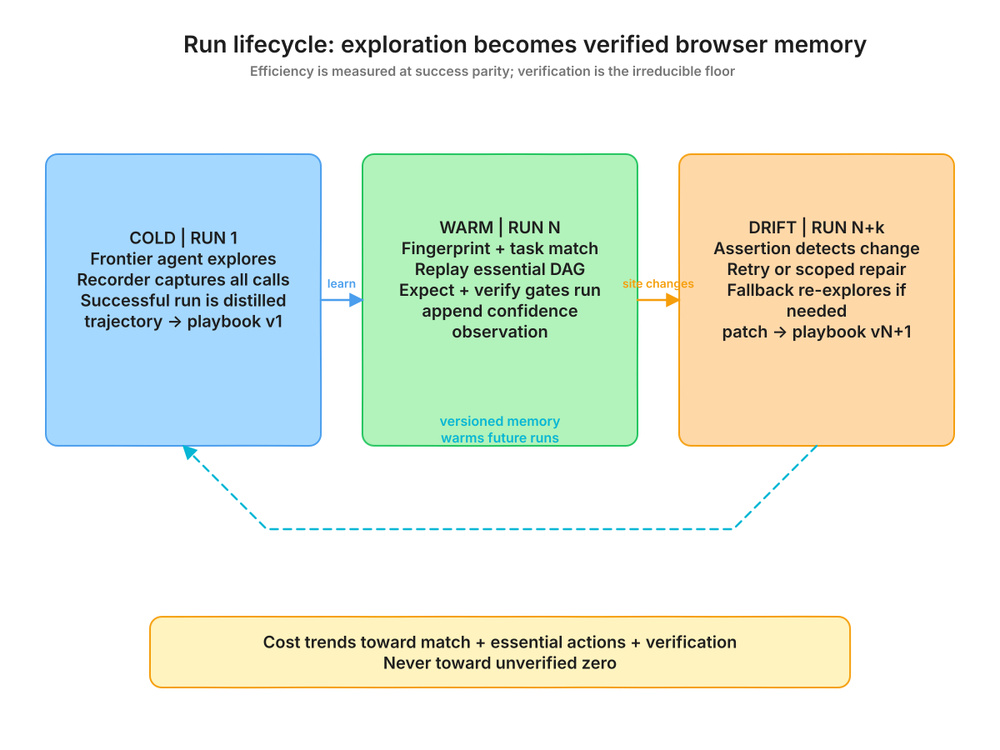

# 02 — Architecture



## Design thesis

> **Agent harnesses have no memory manager. Rote is the memory manager.**
>
> Corollary: control flow should be deterministic. The model's job is content and repair,
> not navigation.

A successful run tangles two things together: *what to do* (the procedure) and *what to
say/fill/decide* (the content). Rote untangles them. The procedure becomes a
deterministic, replayable artifact; the model is invoked only where genuine judgment
lives — binding parameters, filling slots, repairing broken steps.

Rote is a **complete browser-agent harness**, not middleware. Every optimization that
matters lives inside the loop — what the model sees, when it's called, which model, how
actions are grounded — and a layer at the tool boundary can advise but cannot restructure
the loop. Rote's tools are still exposed over MCP, so the same codebase can be *driven
by* another client; the harness and the layer are two entry points, not two products.

### The memory spine

Everything below hangs off one idea. The context window is **memory**, and memory needs a
manager: a budget, an eviction policy, a write path, and a trust gate on the way back in.
No shipping harness has one — they append to a transcript and hope
([04](04-competition.md)).

Three tiers, three timescales, one disease at each: the agent forgets, re-derives, pays
again ([01](01-problem.md)).

| Tier | Scope | Answers | Mechanism | Where |
|---|---|---|---|---|
| **0 — Working** | one run | "what am I looking at, what have I done" | evict observations, diff, budget, cache layout, compact | perception + decision planes |
| **1 — Episodic** | runs of one task | "how did this go last time" | record → distill → playbook → verified replay → repair | learning plane |
| **2 — Semantic** | tasks on one site | "how does this site behave" | site brief, selector maps, settle priors, quirks | learning plane |

The operating-system reading is exact, and worth holding: the context window is RAM,
observations are pages, dropping them is eviction, diffing is delta encoding, the prompt
cache is L2, compaction is GC, a playbook is a cached compiled program, and site memory is
the persistent store. Every one of those has a manager in an OS. **None of them has one in
a browser agent.**

**The trust gate is not a fourth tier — it is the precondition for all three.** Memory that
might be wrong is worse than no memory (invariant 1). Reuse without verification is a
machine for repeating a mistake at volume.

## Status: what is built

**Read this table before believing anything below it.** Design and reality are easy to
confuse in an architecture doc; this is the boundary.

| Subsystem | Tier | State |
|---|---|---|
| Core schemas, Expect DSL, templating, fingerprinting | — | **built** |
| Recorder — append-only, crash-safe, fsync-per-event | 1 | **built** |
| Replay executor — verified, zero-model on hand-written playbooks | 1 | **built** — B5 repairs stale selectors from retained semantic identity before dispatch and fails closed on ambiguity ([T21](testing/T21-b5-drift-certification.md)) |
| CDP browser backend, perception (distill → stable IDs → budget) | 0 | **built for top-level, nested same/cross-origin frames, and nested open shadow roots** — identity v2 carries durable context paths; runtime frame IDs/document tokens stay out of identity; stale/context-mismatch/ambiguity stop before dispatch; declared closed roots are typed unsupported ([T31](testing/T31-composed-browser-contexts.md)) |
| Agent loop, context assembler, tagged LLM client | 0 | **built** |
| Benchmark matrix, per-source accounting, head-to-head gate | — | **built** |
| Enterprise contract corpus (E7.1) | — | **frozen and fixture-qualified** — 19 synthetic grid/frame/shadow/control/SPA/restart cases bind exact external oracles or dispatch-free typed failures; direct real-Chrome fixture controls pass, but product mechanisms remain #128–#133 ([T29](testing/T29-enterprise-contract-corpus.md)) |
| Action plane: settledness, resolution chain, optional expect + scoped repair | — | **built for navigate/fill/select/click/hover/press/upload/dragAndDrop across captured composed contexts; SPA-endurance certified** — [T34](testing/T34-spa-endurance-certification.md) adds document-epoch diff-base retention, the stale-identity dispatch guard, and network-edge settledness with a bounded background-request policy; [T31](testing/T31-composed-browser-contexts.md) qualifies nested-context click dispatch; [T33](testing/T33-enterprise-action-vocabulary.md) qualifies the E7.5 verbs against the frozen control oracles: explicit normalized chords only, uploads restricted to an injected id-referenced allowlist, same-context drag with typed non-draggable failure, and unsupported backend capabilities returning typed errors |
| Final verification | — | **built with an authoritative evidence gate (E7.4)** — every success requires an injected verifier; tasks may additionally declare required authoritative evidence classes, satisfied only by versioned redacted envelopes from injected fixture/API/database/download adapters with subject and freshness binding ([T32](testing/T32-authoritative-outcome-evidence.md)); the public CLI verifier remains visible-text/URL based and counts as supporting evidence only |
| **Observation eviction** — keep actions, drop prior observations | 0 | **built and recall-stress tested** — post-eviction context marks the recall boundary; unavailable facts and fabricated comparisons fail closed ([T18](testing/T18-eviction-recall-trade.md)) |
| **Diff observations** (A4) | 0 | **built and real-page measured** — the G1 certification emits 849 diffs with a 24-character median and 99.6% median reduction relative to each diff's preceding grounded base ([T10](testing/T10-g1-cumulative-token-curve.md)) |
| **Cache-layout discipline** (B3) | 0 | **built and economically qualified on OpenAI** — exact immutable prefixes receive deterministic cache-routing keys; WP-N25 cost falls 20.5% and clears Browser Use by 16.0% with both 95% intervals above zero ([T11](testing/T11-cache-key-economics.md)) |
| **History compaction** (B4) | 0 | **built; 60-step SPA endurance certified deterministically** — action history compacts after 24 actions on 16-action boundaries, retaining an exact tail plus provenance-preserving representatives; [T34](testing/T34-spa-endurance-certification.md) certifies ≤31 visible actions and 3 reported boundaries over 60 transitions in 15 fresh real-Chrome runs; provider-billed economics remain unmeasured |
| Structural action-contract drift gate | 1 | **built for replay** ([T35](testing/T35-action-contract-gate.md)) — versioned value-free `ActionContract` (verb, identity/context, affordance, safety, preconditions, effect reference) is derived from the live capture and compared with the recorded one before dispatch; incompatible affordance/destination/safety/precondition changes return typed `contract_mismatch` with clean classified fallback, cosmetic/selector/wrapper drift continues, the live loop records contracts for the distiller to persist, and `npm run demo:action-contract` demonstrates all of it in real Chrome ([T35 §Public demonstration](testing/T35-action-contract-gate.md#public-demonstration)) |
| **Multi-session continuation** (E7.7) | 1 | **built** ([T37](testing/T37-multi-session-continuation.md)) — append-only `TaskCheckpoint` log bound by environment/principal/procedure/bindings digests plus authoritative-evidence references; resume gate runs before any action; executor skips completed steps and checkpoints after each one; verified across real Chrome process restarts |
| **Playbook distiller** (trajectory → playbook) | 1 | **built (v1, deterministic)** — [T36](testing/T36-distiller-v1.md): keeps dispatched actions (evidence present), prunes with reasons (done, pre-dispatch failures, superseded writes), carries resolved identity + context + recorded action contract, synthesizes `expect` from strong evidence only, templates every declared value and refuses undeclared typed values; B1/B2 record → distill → replay in real Chrome with zero LLM calls and zero edits |
| **Matcher** (semantic match + bind) | 1 | **not built** — fingerprint gate only |
| **Site memory, model routing, speculation** | 2 | **not built** — designed below |

Packages that exist: `core recorder executor bench cli browser perception action agent llm`.
Designed but absent: `decision predictor memory mcp-server`.

**Tier 0's launch scope is built and measured.** G1 measures eviction/diff growth, T11
qualifies cache layout, corrected G2 measures task levels, and T21 grades deterministic
target drift. History compaction landed first under the explicit #107 implementation waiver; T28 subsequently closed P1 launch evidence, and T34 certified 60-step SPA endurance deterministically ([05](05-roadmap.md)).

## The four planes

The planes are *where code lives*; the memory tiers are *what it is for*. They cross.

| Plane | Baseline cost | Rote's answer | Serves tier | Status |
|---|---|---|---|---|
| **Perception** | 5–40K tokens/step, re-sent every step | distill → grounded bootstrap → diff → budget | 0 | built and deterministically exercised; not yet measured live |
| **Decision** | frontier model, every step, full context | cache-local layout; route down or skip the model | 0, 1 | **layout not built** — its accounting prerequisite is (#57); routing designed |
| **Action** | act → wait → observe, serialized | settledness, self-healing resolution, speculation | — | first two built |
| **Learning** | every run starts cold | recorded trajectories → playbooks → site memory | 1, 2 | recording + replay built |



## Tier 0 — working memory

The context window is a managed resource with a budget, an eviction policy, and a layout
contract. This is the tier where the exponent lives, and the only one where no competitor
is building ([04](04-competition.md)).

Per planner call today (`packages/agent/src/context.ts`):

| Segment | Size | Behavior |
|---|---|---|
| `stablePrefix` — instructions, task, action schema, expect guidance | ~268 tok | constant |
| `Current page: {title} \| {url}` | ~20 tok | constant |
| `Previous actions:` — one JSON action per prior step | **~35–40 tok/step** | **grows linearly** |
| `Compact observation ({mode})` | ~135 tok (B2) | constant per page, re-sent fresh |

Step *n* costs `268 + 20 + 40n + obs`, so the sum over *n* steps carries a `40·n(n+1)/2`
term. That term is the parabola. The measured +35 tok/step matches one action JSON exactly
— the arithmetic and the telemetry agree.

### The policy: keep what you did, not what you saw

The standard agent pattern is a chat transcript —
`[system, user(obs₁), assistant(act₁), user(obs₂), …]` — in which **every observation stays
in context forever**. At 5–40K tokens each, step 20 is a 100–800K token prompt. It is what
the chat API shape encourages, and it is the catastrophic form of the quadratic.

`assemblePlannerContext` does not do this. It sends the action history plus the **current
observation only**; prior observations are evicted. That is why growth is 35 tok/step and
not 135+ — **the measurement proves the policy**.

**The trade, stated plainly:** the model recalls what it *did*, not what it *saw*. Correct
for form-filling and navigation. It will fail on tasks whose answer lives in an evicted
observation — "compare prices across three products". After content is first omitted, the
volatile context marks that recall boundary and instructs the planner to return the typed
`recall_unavailable` failure instead of guessing. Independent verification still rejects a
fabricated comparison as `verification_failed`. T18 exercises both exits across two pages
([T18](testing/T18-eviction-recall-trade.md)). The task still fails; the protection is that
it fails honestly.

### The four levers

| Lever | Effect on the curve | Status |
|---|---|---|
| **Evict observations** | kills the dominant quadratic term | **built** (A4-adjacent; never claimed) |
| **Diff the current observation** (A4) | −~90% on the constant, on real pages | **built and measured** — 849 WordPress certification diffs have a 24-character median and 99.6% median reduction against their preceding grounded bases ([T10](testing/T10-g1-cumulative-token-curve.md)) |
| **Prefix-cache `[stable][history]`** (B3) | discounted billing on the surviving prefix | **built and OpenAI-economics qualified** — exact-prefix routing cuts WP-N25 Rote cost 20.5% and clears Browser Use by 16.0% ([T11](testing/T11-cache-key-economics.md)) |
| **Scheduled compaction** (B4) | action history → O(1) in steps; cumulative action-history input → O(n) | **built deterministically; not yet provider/SPA-qualified** |
| **Replay** (B2) | 0 steps, 0 tokens | distiller v1 built ([T36](testing/T36-distiller-v1.md)); matcher/selection still explicit |

### Caching: exact-prefix routing, measured economics

OpenAI prompt caching is automatic once an exact prefix clears the model threshold. T4
first moved append-only history ahead of page churn and minimally qualified a 1,024-token
hit. T11 now hashes the exact stable prefix into `prompt_cache_key`, while runtime and
sacred invariant checks reject volatile metadata or within-run prefix mutation. No prompt
padding is added. In a fresh identically ordered paired matrix, WP-N25 cache reads rise
10,377→29,722 tokens/run, Rote cost falls 20.5% (95% CI 11.3–30.3%), and Rote is 16.0%
cheaper than Browser Use (6.2–26.2%). WP-N09 remains a cost loss whose interval crosses
parity. Anthropic remains optional and would require explicit `cache_control` support.

The accounting was also blind to it, and that is now fixed
([#57](https://github.com/kedarvartak/rote/issues/57)) — **the accounting had to land
before any caching work**, because the two providers mean opposite things by the same
field name:

> **Anthropic's `usage.input_tokens` EXCLUDES cache activity** — `cache_read_input_tokens`
> and `cache_creation_input_tokens` are siblings, so the true prompt size is their sum.
> **OpenAI's `usage.input_tokens` INCLUDES it** — `input_tokens_details` is a *breakdown*.

`@rote/llm` read only `input_tokens` on both, which broke in **opposite directions**
(measured live, 2026-07-17, `gpt-5.6-luna`, a ~4K prompt sent twice):

```
OpenAI cold: input_tokens=4027  cached=0     cache_write=4024
OpenAI warm: input_tokens=4027  cached=4024  cache_write=0
```

- **Anthropic** — reported input *collapses* when cached: a **fake token win** that never
  happened, published by the instrument we use to prove our efficiency claims.
- **OpenAI** — reported input *stays flat* at 4027: **no win visible at all**, and 4024
  cached tokens priced at the base rate instead of ~0.1×, **overstating** cost ~10× on the
  cached portion.

The same one-line bug would have made Rote look artificially cheap on one provider and
artificially expensive on the other, in the same benchmark. `TokenUsage` is now normalized
at the provider boundary onto one contract —
`input_tokens + cache_read_tokens + cache_write_tokens === the provider's true prompt size`,
with `input_tokens` always the uncached remainder — and property-tested against both shapes.

**Our fixtures still cannot exercise caching.** The minimum cacheable prefix is
model-dependent: OpenAI begins automatic caching at 1024 tokens; Anthropic thresholds
range from 1024 to 4096 tokens by model. B2's per-call prompts are 637–953 — below all of
them. The real WordPress page clears OpenAI's total-prompt floor, but E3 must prove that
the *unchanged prefix* does too and that provider-reported `cache_read_tokens` become
nonzero before B3 can move from unproven to built.

### Caching and compaction fight

Caching requires the prefix to be immutable; compaction rewrites history to bound it.
Compact every step and you cache-miss every step — you have paid for both mechanisms and
bought neither. B4 therefore keeps the rendered history byte-append-only between explicit
boundaries: the default retains the first 24 actions exactly, compacts every 16 older
actions thereafter, and keeps at least eight exact recent actions plus at most eight real older
representatives. Boundary metadata records the compacted count and digest without values.
A disabled policy preserves the unbounded baseline. The 16-action interval is based on
T10's measured 35–40 logical tokens/action and OpenAI's 128-token cache increments; it is
a deterministic initial schedule, not yet a provider-cost optimum. T34 certifies the
mechanism over 60 SPA transitions (three reported boundaries, non-growing peaks); the
provider-billed cache-miss/savings trade over 50+ steps is still required before any
economic claim.

### What is unproven

G1 now measures a 37.2% slower logical-input slope than Browser Use (95% CI 35.6–38.8%)
and A4's 849 live WordPress diffs show 99.6% median render-size reduction against their
preceding grounded bases ([T10](testing/T10-g1-cumulative-token-curve.md)). The bootstrap
contract remains fail-closed above 100,000 characters.

The B4 mechanism now structurally bounds planner-visible action count, so its cumulative
action-history contribution is linear in step count. This does **not** yet prove a linear
provider curve, production-SPA parity, or a cost win: task text, current observations,
repair content, cache misses, and provider tokenization remain measured terms; the only
50+ step certification so far ([T34](testing/T34-spa-endurance-certification.md)) is
deterministic and zero-token. The frozen pre-cache-key matrix did not prove cost or latency wins. T11 subsequently makes
Rote 16.0% cheaper than Browser Use at WP-N25 (95% CI 6.2–26.2%), but WP-N09 still loses
and crosses parity: this is not a universal cost claim. The eviction trade is now
fake-world stress-tested to fail cleanly when an earlier-page fact is unavailable (T18),
but compare-across-pages success remains unsupported. B1/B3 retain frozen level evidence.
T19 found that B2's v1 oracle proved generic completion rather than all eight requested
values, T20 protocol-v2 exact certification restores B2/full G2 at 18/18 parity per harness
([T20](testing/T20-b2-exact-certification.md)). The local fixtures do not establish
production-site generality.

Manual exact-fingerprint candidates now return to the plain agent when replay fails or
throws, with the classification and detail retained. That cold path re-navigates the
pinned initial URL ([T15](testing/T15-replay-fallback.md)). It cannot generically roll back a server-side mutation made before the
failure; safe replay therefore still depends on assertion placement and task/site reset
semantics until transactional recovery exists.

## The control loop

```ts
async function runTask(task: TaskSpec, deps: HarnessDeps): Promise<TaskResult> {
  const fp = await fingerprint(deps.session);          // invariant 3: hard gate
  const brief = deps.memory.brief(fp, task);           // site memory, ≤1K tokens  [planned]
  const ctx = ContextAssembler.init({ task, brief });  // owns cache layout

  const match = deps.memory.matchPlaybook(fp, task);   // [planned]
  if (match?.confidence >= TAU_REPLAY)
    return deps.executor.replay(match, task.params);   // zero model steps  [built]

  while (true) {
    await deps.action.settled(deps.session);                            // built
    const obs = await deps.perception.observe(deps.session, ctx.budget); // built
    ctx.push(obs);                                                       // diff-encoded

    const route  = deps.decision.route(ctx, deps.memory);   // [planned] → frontier today
    const action = await deps.decision.decide(route, ctx);  // structured output, built

    const outcome = await deps.action.dispatch(action, deps.session);   // built
    deps.recorder.record(outcome);                                      // always
    if (outcome.expect.some(failed)) {
      const recovered = await deps.recovery.ladder(outcome, ctx);       // [partial]
      if (!recovered) return failCleanly(outcome);                      // invariant 2
    }
    if (action.verb === 'done')
      return deps.verify.gate(task, ctx)   // invariant 1: no verify pass, no success
        ? success(action.result)
        : deps.recovery.escalate(task, ctx);
  }
}
```

**The ContextAssembler owns message layout** and is the only module allowed to reorder
them: immutable system prompt + tool schemas → session-stable site brief → compacted
history → live tail. Prompt-cache reads are ~10× cheaper and agent loops re-send the
whole transcript every step, so **hit rate ≈ spend**. Tests fail if any volatile token
(timestamp, run id) lands above the stable line.

## Type spine (Zod-first; types derived, never hand-written)

```ts
// perception
type StableNodeId =
  | { hash: string }                           // historical v1, immutable
  | { version: 2; hash: string; contextHash: string; containerHash: string }
type Observation =
  | { kind: 'full';    page: PageIdentity; tree: DistilledNode[]; tokens: number }
  | { kind: 'diff';    page: PageIdentity; baseSeq: number; changes: NodeChange[] }
  | { kind: 'summary'; page: PageIdentity; text: string; expandable: Region[] };

// decision
type StepClass = 'replay' | 'speculated' | 'grounded-routine' | 'frontier' | 'recovery';

// action — a small closed verb set, not 50 overlapping tools
type Action =
  | { verb: 'navigate'; url: string }
  | { verb: 'click';  target: StableNodeId }
  | { verb: 'fill';   target: StableNodeId; value: string }
  | { verb: 'select'; target: StableNodeId; option: string }
  | { verb: 'extract'; query: ExtractQuery }
  | { verb: 'done'; result: unknown } | { verb: 'fail'; reason: string };

interface StepOutcome {
  action: Action; result: ToolResult;
  expect: ExpectVerdict[];
  timing: { settleMs: number; actMs: number; observeMs: number; thinkMs: number };
  tokens: PerSourceTokens;          // invariant 5: every call tagged
}
```

**Stable IDs are a schema-level commitment.** They appear in trajectories, playbooks, and
memory, which is what makes diffs (`"#e42 changed"` rather than re-listing the page) and
cross-run learning possible at all. The field's ids are runtime identities — CDP
backend-node ids or per-scrape counters — that die on navigation, so no other harness
can name an element across runs (see [04](04-competition.md), 2026-07-25 source read).

Historical artifacts retain **v1**:
`hash(role, accessible name, floor(DOM depth / 2))`. New captures emit **v2**:
`hash(v2, role, accessible name, context hash, container-lineage hash)`, accompanied by its
version and component hashes. Planner/action/trajectory references use `v2:<hash>` while
historical v1 references remain unprefixed. Capture hashes only allowlisted semantic ancestors (`role`,
`aria-label`, explicit row key, and container kind); it ignores generic layout wrappers,
selectors, and control values. Repeated keyed rows therefore remain distinct through
reorder, remount, and selector rename. An unkeyed repeated control can still collide by
design, but typed ambiguity now stops before text or selector fallback. V1 remains parseable
without in-place migration; a historical target may degrade through exact role/name recovery
or fail cleanly. E7.3 now populates non-top-level browsing contexts with versioned ordered
frame/shadow segments, a durable `contextHash`, and a fresh `documentToken`. The token is
excluded from identity but checked immediately before dispatch, so navigation or detach
between resolution and action returns a typed stale-context failure.

Identity answers **which control**, not **whether its behavior is still compatible**.
[#143](https://github.com/kedarvartak/rote/issues/143) adds the structural action-contract
trust gate ([T35](testing/T35-action-contract-gate.md)). Every distilled interactive node
carries a value-free `affordance` (control kind, input type, Enter behavior, destination
digest, form method, enabled, draggable); `deriveActionContract` turns the resolved node plus
verb into a strict versioned `ActionContract` with a safety class refined by what the
control observably does; `compareActionContracts` applies an explicit matrix — cosmetic,
selector, wrapper, name, and stable-id drift continue, while verb, role, context,
affordance, destination, safety, precondition, or declared-effect changes are
`contract_mismatch`. Replay compares the recorded contract with the live one **before
dispatch** and falls back with a typed code; the live loop records the contract on every
element step so distiller v1 persists behavior, not just identity. The gate is as
expressive as the capture: a same-path handler whose server behavior changed is caught by
E7.4's authoritative outcome, not by this comparison.

### Enterprise browser contracts (E7.1 frozen; mechanisms planned)

Implementation order is binding because every later layer persists assumptions from the
one before it ([07 §E7](07-execution-plan.md)):

1. **Done:** freeze 19 adversarial synthetic fixtures and authoritative outcome oracles
   (#127, [T29](testing/T29-enterprise-contract-corpus.md)). The direct fixture smoke is
   not traversal/action support.
2. **Done:** version context-aware target identity and collision behavior (#128).
3. **Done:** carry identity through nested same/cross-origin iframes and open shadow roots;
   reject stale/context-spliced actions and classify declared closed roots unsupported
   (#129, [T31](testing/T31-composed-browser-contexts.md)).
4. **Done:** version verification evidence with provenance, freshness, task binding, and injected
   authoritative adapters (#130, [T32](testing/T32-authoritative-outcome-evidence.md)).
   UI state remains supporting evidence, not forbidden: the base verifier stays necessary,
   while a declared authoritative requirement is satisfiable only by envelopes whose class,
   subject, generation, and (optionally) exact payload digest match. Missing, stale,
   other-task, and digest-mismatched evidence return typed classifications; an unreachable
   source throws instead of classifying.
5. **Done:** add grounded hover, keyboard, allowlisted upload, and drag/drop only with
   action-specific evidence, redaction, settledness, and typed unsupported exits
   (#131, [T33](testing/T33-enterprise-action-vocabulary.md)). Chords normalize against
   an explicit allowlist before dispatch; uploads reference injected allowlisted ids and
   file material never enters observations, records, errors, or evidence; drag requires
   one browsing context and a draggable source; new-verb DOM reactions are recorded but
   never enforced — declared authoritative outcomes stay with E7.4 evidence.
6. **Done:** certify B4 on a 60-transition single-session SPA through the product loop
   (#132, [T34](testing/T34-spa-endurance-certification.md)). `CapturedPage.documentToken`
   separates same-document route pushes from document loads so the diff base survives an
   SPA transition; an already-dispatched identity that vanished on remount cannot rebind
   by fuzzy text (`ElementResolutionStaleIdentityError`); settledness counts unanswered
   requests only and treats every network edge as activity, so long-lived background
   channels are bounded by policy rather than waited on forever.
7. **Done:** distiller v1 persists these contracts ([T36](testing/T36-distiller-v1.md)) —
   distilled steps carry identity v2, browsing context, and the recorded action contract,
   so replay of a learned playbook is contract-gated exactly like a hand-written one.
8. **Done:** append-only, fingerprint-gated multi-session continuation (#133,
   [T37](testing/T37-multi-session-continuation.md)) — digest-bound checkpoints, a
   fixed-order resume gate, executor resume that never re-dispatches a completed step,
   and E7-CONTINUATION-RESTART/MISMATCH through real Chrome process restarts.

This sequence intentionally puts contracts before learning. Otherwise the distiller would
turn target collisions, top-level-only traversal, UI-only assertions, and an incomplete
action vocabulary into durable playbooks that append-only history cannot silently repair.

## Playbooks

A playbook is a parameterized step DAG. Humans never author them — agents discover them —
but they export to readable YAML precisely so humans can audit them.

```yaml
playbook: submit-vendor-invoice
version: 3                       # patches bump versions; history kept
task_signature:
  env_fingerprint: {domain: vendors.acme.com, tools: [browser.*]}
params:
  - {name: invoice_id, type: string}
steps:
  - id: open_portal
    tool: browser.navigate
    args: {url: "https://vendors.acme.com/invoices"}
    expect: {selector_visible: "#invoice-table"}
    on_fail: repair              # repair | retry(n) | fallback
  - id: fill_amount
    tool: browser.fill
    args: {selector: "#amount", value: "{{amount}}"}     # slot
    expect: {input_value: "#amount", equals: "{{amount}}"}
verify:
  - {text_visible: "Invoice submitted"}
confidence: 0.94                 # updated every run
```

Three step kinds, deliberately minimal:

- **Deterministic** — tool + bound args. Zero model tokens.
- **Slot** — the model fills a value. Small, scoped, cheap-model-eligible.
- **Judgment gate** — a rare explicit branch, encoded as constrained classification, not
  free-form planning.

## Verification, and what T1 taught us

Stored replay steps carry postconditions; live planner actions may carry an `expect` only
when it is grounded rather than guessed. Every task carries a final independent verifier.
**Success is only reported if final verification passes** — invariant 1, and the anchor
under every efficiency claim (all benchmark numbers are *at success parity*).

[T1](testing/T1-openai-dry-run.md) found the live-agent version of this was
mis-designed: the action schema made `expect` **mandatory**, so the planner had to
predict the page's confirmation text before seeing it. It guessed plausibly and wrongly,
and correct runs were recorded as failures (B2: 0/7). Meanwhile the expects that *passed*
were largely tautological — asserting a value the model itself had just typed.

The lesson generalizes: **a model-authored postcondition about a future state is either a
guess or a tautology.** T1's B2 sharpened it further — the confirmation section is
`hidden` until submit and the distiller drops hidden nodes, so the post-click state was
not expressible in *any* primitive of the DSL. Text or selector alike, the model had
never seen it. Steering toward "structural" expects would only have moved the guess from
a string to an id.

**Resolved ([#49](https://github.com/kedarvartak/rote/issues/49),
[#50](https://github.com/kedarvartak/rote/issues/50)) — `expect` is now optional:**

1. The planner is told to **omit** rather than guess, and does: across live re-runs it
   omitted on every action of B1/B3/B2, so the tautologies disappeared too. Forcing the
   field was itself the cause of both failure shapes — a mandatory slot with nothing true
   to put in gets filled with an invention or a restatement.
2. A failed expect is no longer fatal. It buys **one scoped repair** (rung 2 below),
   because a failed assertion means the model's belief was wrong, not that the action
   was — on B2 the submit had already landed. Exhausting the budget is fatal.
3. Success still requires the independent final `verify` gate, authored against ground
   truth. That gate is what makes B1/B3/B2 successes real, and it never moved.

Result: B2 0/7 → **11/11** on `gpt-5.6-luna` and `gpt-5.6-sol`, at roughly neutral token
cost (B3 got ~1% *cheaper* — the output tokens saved by not emitting `expect` paid for
the prompt guidance).

### Decision for #54: derive evidence from the observed transition

A model should not predict the postcondition. The action plane already owns the dispatched
arguments and can compare the settled capture before the action with a fresh settled
capture after it. That transition produces zero-LLM **post-action evidence**:

| Action | Derived evidence | Strength | Initial policy |
|---|---|---|---|
| `fill` | Resolved live control value exactly equals the dispatched value | strong effect check | enforce |
| `select` | Resolved live select value exactly equals the dispatched option value | strong effect check | enforce |
| `navigate` | Canonical final URL exactly equals the resolved requested URL | strong effect check | enforce; redirects require an explicit later policy |
| `click` | Final URL changed, or the distilled before/after observations have at least one added, removed, or updated node | **reaction only** | record in shadow mode; do not enforce yet |
| `done` | none | not applicable | final independent verifier remains mandatory |

“Reaction” is deliberately not called verification. An unrelated timer can change the DOM
after a no-op click, while a legitimate download can have no DOM effect. Treating any diff
as proof of the requested effect would violate “never silently wrong”; rejecting every
no-diff click would violate “never worse than baseline.” Click evidence may become enforced
only after a frozen qualification corpus includes no-op controls, DOM-changing controls,
navigation, downloads, and unrelated background mutation, with zero false accepts and a
bounded false-reject policy. B1's fixture download is one positive case because it exposes
an authoritative completion node; it is not proof that downloads generally mutate the DOM.

The derivation lives as pure action-plane logic over captured pages and distilled nodes.
It must not add form values to `DistilledNode` or the planner's rendered diff: captured
values can be credentials, and post-action checking is not a reason to spend tokens or
expand secret exposure. Recorded evidence carries the action kind, resolved target
identity, classification, and pass/fail status, but not a second copy of the value.

Implementation order is binding:

1. Add property/deterministic tests for strong effects, no-op clicks, unrelated mutation,
   and URL canonicalization before integration.
2. Capture once after dispatch, derive evidence with no planner call, and record it on the
   step. Strong failures enter the existing typed postcondition-repair path and can never
   be recorded as a successful step.
3. Keep click reaction shadow-only until its separate qualification gate passes. Final
   task success continues to require independent `verify` in every mode.

The strong-effect derivation, bounded repair integration, redacted trajectory evidence,
and shadow click classifications are implemented with deterministic and property tests.
[T26](testing/T26-post-action-evidence-qualification.md) then passes 9/9 fresh canonical
B1–B3 attempts with 33/33 strong effects, 57/57 reconciled receipts, and zero repairs.
Generic click reaction remains permanently non-enforcing for P1: unrelated mutation can
false-attribute a no-op, while external effects can leave no captured diff. Future click
gates need action-specific authoritative evidence, not a threshold over generic churn.
This completes [#54](https://github.com/kedarvartak/rote/issues/54) without marketing
reaction as verification.

## Repair ladder



On assertion failure — never fail the task blindly, never silently continue:

1. **Retry** — transient (network, timing), per step policy.
2. **Scoped repair** — a model call with *narrow* context: the failing step, its expected
   postcondition, observed state, and the step's intent. It re-derives one step, emits a
   **patch**, replay resumes. Patches are additive and versioned; bad patches roll back,
   and patch history is itself a drift signal.
3. **Fallback** — full agent run, recorded, re-learned. Worst case equals not having Rote.

Cheap recovery is an efficiency feature: a scoped repair costs ~one step; a blind restart
costs the whole task.

## Tiers 1 and 2 — the learning plane (designed)

Three stores, in build order. They implement memory tiers 1 (episodic) and 2 (semantic);
the numbering below is the *store*, not the tier — see §The memory spine.

| Store | Tier | Content | Mode |
|---|---|---|---|
| **Playbook** | 1 | whole-task DAG, exact repeats | replay (contract: verified, zero-model) |
| **Subflow** | 1 | shared prefixes (login → dashboard) reused across tasks | replay with hand-off |
| **Site memory** | 2 | selector maps, form semantics, page graph, settle times, quirks | **advisory** — the agent stays in control |

The distinction matters: the tier-1 stores *execute*; tier 2 only *informs* (a ≤1K-token
brief, resolution hints, calibrated settle times). **Advisory memory can be wrong without
being dangerous** — the agent still observes and verifies. Executable memory cannot, which
is why only tier 1 is assertion-gated on replay.

Tier 2 also feeds tier 0: a site brief is working-memory content with a token budget, and
a brief at 5% utility is overhead, not memory ([03](03-benchmark.md) reports hint utility
for exactly this reason).

## Speculative execution (designed)

The loop is fully serialized: think → act → settle → observe → think. **While the model
thinks about step N, the predicted step N+1 can already be executing** in a shadow
context — promote on hit, discard on miss, never past the effect boundary. This needs an
action safety classifier (`pure-read` / `local-nav` / `local-write` / `external-effect`),
a session virtualizer, and a predictor over recorded runs. Research with blind draft
models reaches ~55% accuracy for ~20% latency; trajectory memory should predict warm
sites far better. Kill gate: ≥70% top-1 accuracy offline, before any systems work —
**passed** by a history-only trace matcher ([T38](testing/T38-predictor-kill-gate.md):
99.4% kind+target on fixture runs, 96.5% by verb on live WordPress runs whose targets
were not recorded; curve runs now record a value-free `action_target` per step so the
next billed collection scores kind+target on real pages).

## Run economics



| | Cold (run 1) | Warm (run N) | Drift (run N+k) |
|---|---|---|---|
| Model in control loop | every step | never | one step |
| Tool calls | ~40 (incl. dead ends) | ~6 (essential only) | ~8 |
| Artifact | trajectory → playbook v1 | confidence++ | patch → v2 |

Illustrative, not measured — the measured numbers live in [03](03-benchmark.md) and
[testing/](testing/). The marginal cost of a memoized task trends toward the
**verification floor**: the price of proving the replay still holds. That floor is the
honest lower bound. You never reach zero, because trusting an unverified replay is how
you ship wrong answers.

## Invariants

1. **Never silently wrong** — every replayed step is assertion-gated; no path reports
   success on a failed check.
2. **Never worse than baseline** — full-agent fallback always reachable, and it logs
   *why* it fired.
3. **Never cross environments** — structural fingerprint is a hard gate. A playbook
   learned on staging cannot fire on prod.
4. **Everything versioned** — playbooks and patches are append-only, with rollback.
5. **Every model call is tagged** — `planner|matcher|slot|repair|verify|distill`, through
   one client wrapper. Untagged calls fail lint.

These bind the agent loop exactly as they bound the middleware design. They are not
negotiable under schedule pressure; see `CLAUDE.md`.

## What Rote is not

- **Not a workflow engine** — humans never author playbooks; agents discover them.
- **Not semantic memory** — Rote stores procedures, not facts. Pair with Mem0/Zep:
  they inject knowledge, Rote removes work.
- **Not compression** — orthogonal. Compression shrinks a step; Rote declines to run it.

Next: [03 — Benchmark](03-benchmark.md)
