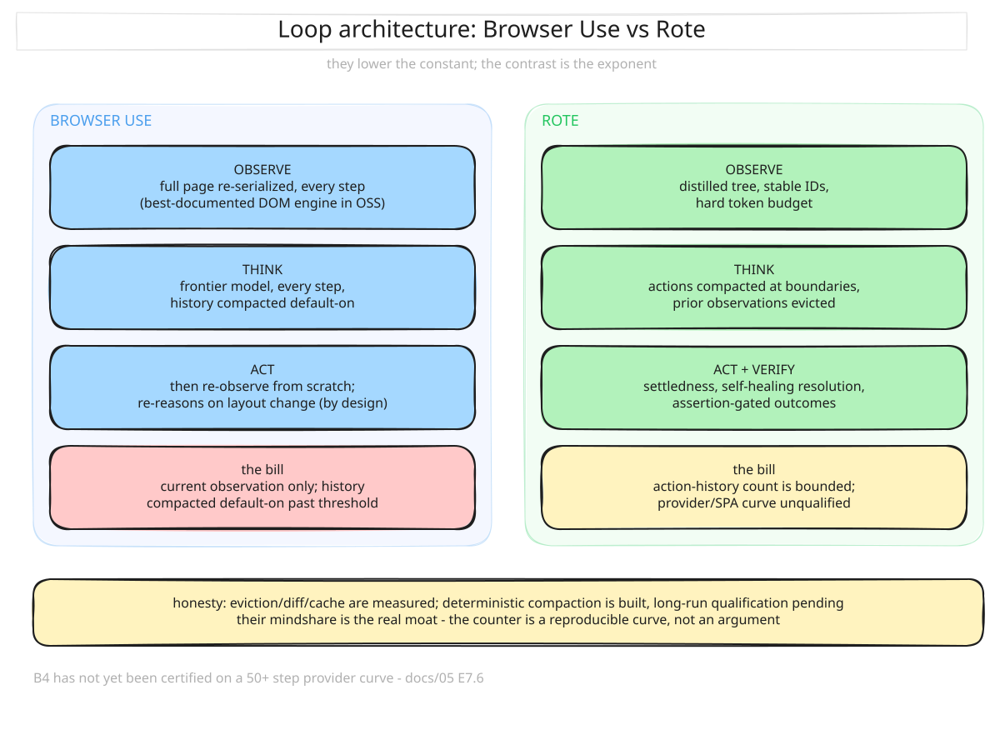
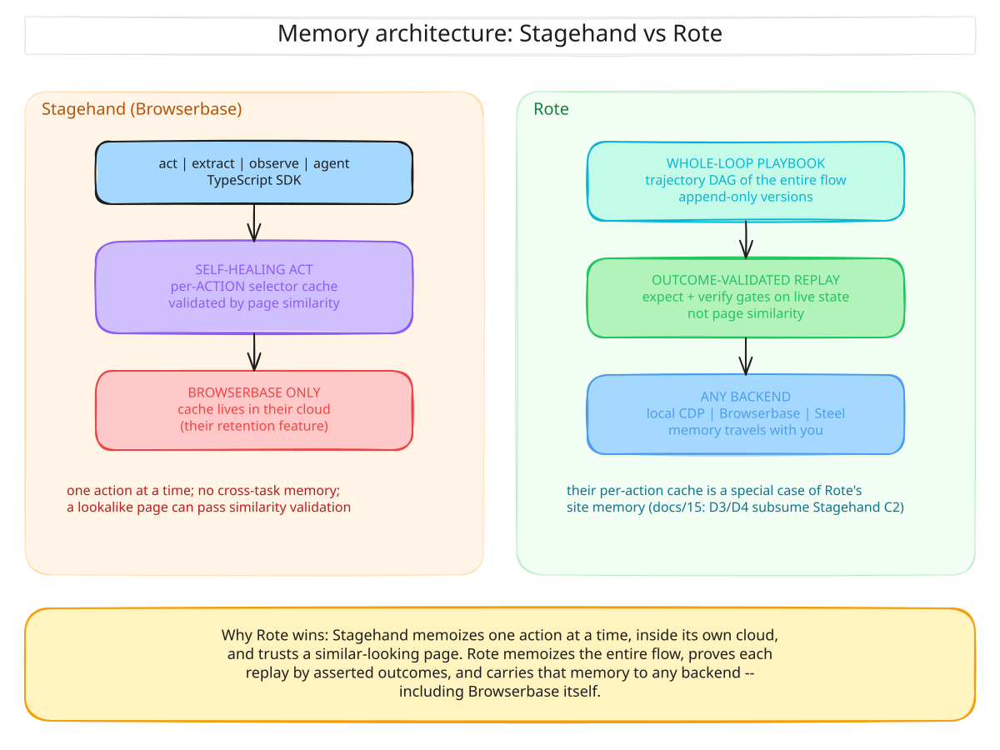
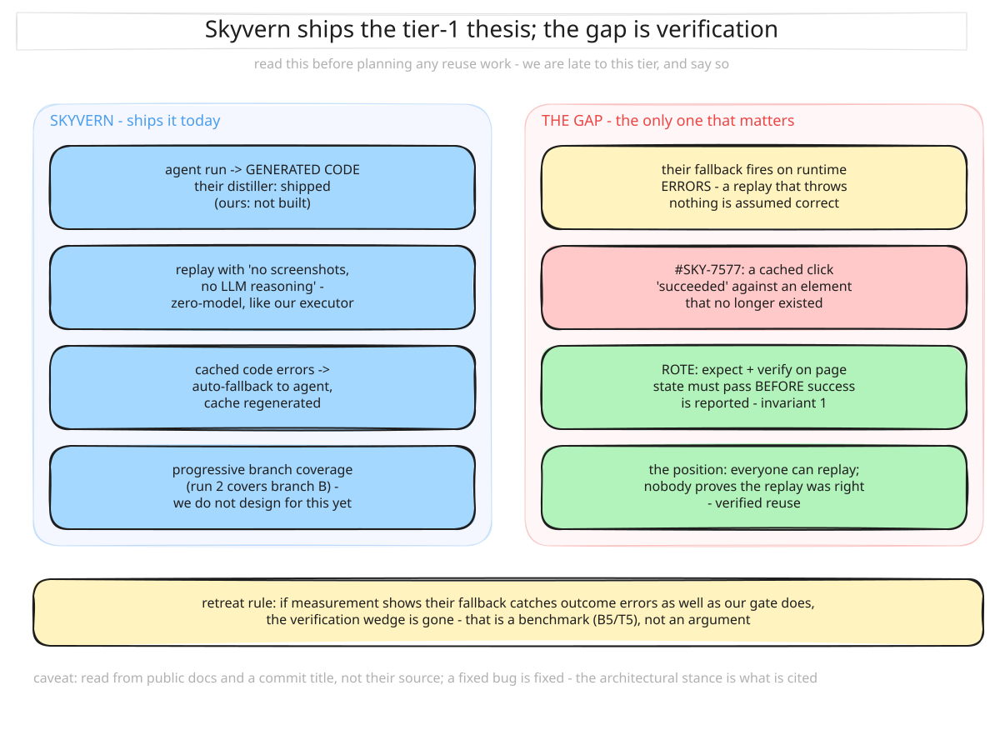
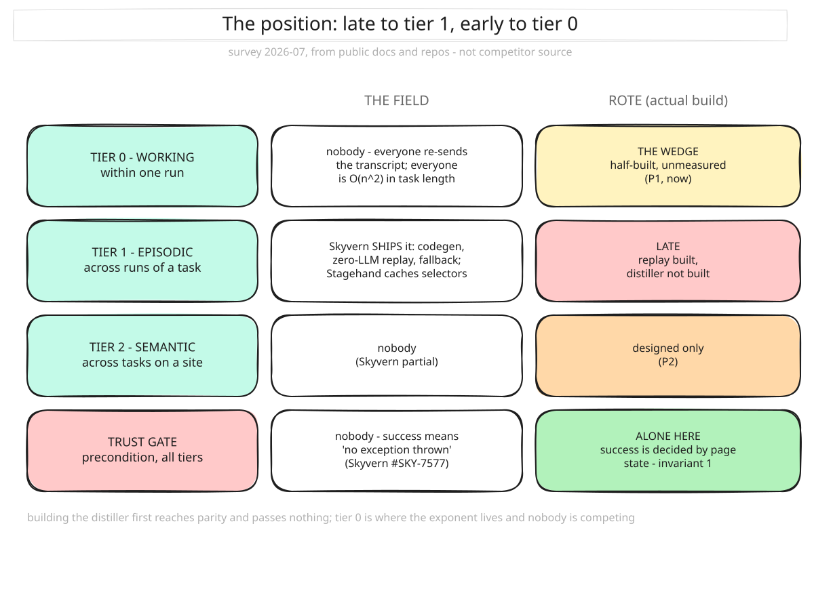

# 04 — Competition

> Surveyed 2026-07-16 against public docs and repos; **re-surveyed 2026-07-25 against
> source** — browser-use at tag 0.13.6 (the exact version G1 benchmarked), Skyvern HEAD,
> Stagehand v3 HEAD, `magnitude-core` 0.3.1, plus vendor docs for the labs. The source
> read corrected this doc in both directions: **observation eviction is table stakes**
> (every major harness evicts or masks old observations), and **cross-step observation
> diffing is absent from every major harness**. Research recommends diffing (arXiv
> 2312.07540 on NetHack; arXiv 2604.01535 for web agents); the only wild sighting is a
> ~14-star MCP tool server (`agent-web-interface`). Nobody ships it as the default
> representation in a benchmarked production harness — that is the claim, stated
> exactly, and it is the one we can defend.
> Optimization IDs (A4, C3, …) refer to [06 — Optimizations](06-optimizations.md).
>
> **The two findings that set the position:** reuse is table stakes (Skyvern ships our
> thesis, with branch coverage we don't design for), and no harness verifies that a
> replayed run was *correct*. We are late to memoization and early to two things:
> **verified** reuse, and **WebMCP** consumption.

The measured expansion is frozen in the [competitor expansion plan](competitor-expansion-plan.md): T22 stopped Stagehand before certification. T23 then stopped pinned Skyvern 1.0.47 before comparative ranking because self-hosted aggregate telemetry was not a complete set of raw provider receipts. T24 qualified pinned Browser Use 0.13.7 on corrected B2/B5; T25 then certified a separate 18-pair corrected-B2 cell with complete receipt reconciliation. T27 stops pinned Magnitude 0.3.1 after six bounded corrected-B2 timeouts and no complete raw receipt set. Cold and warm/drift scorecards remain separate so hand-authored replay is never mislabeled as learning.

Sources for the 2026-07 survey:
[Skyvern code caching](https://www.skyvern.com/docs/developers/features/code-caching) ·
[Stagehand caching](https://www.browserbase.com/blog/stagehand-caching) ·
[WebMCP reality check](https://studiomeyer.io/en/blog/webmcp-reality-check-may-2026) ·
[WebMCP browser support](https://dev.to/ai-agent-economy/webmcp-in-2026-which-browsers-support-navigatormodelcontext-complete-compatibility-status-1oe4) ·
[harness comparison](https://dev.to/stevengonsalvez/browser-tools-for-ai-agents-part-2-the-framework-wars-browser-use-stagehand-skyvern-4gn)

## The field, in four strata

Rote competes in stratum 2, buys from 1, runs models from 4, and adopts 3.

```text
4. MODELS      GPT/CUA, Claude computer-use, Gemini/Mariner, Fara-7B, UI-TARS
3. STANDARDS   WebMCP (navigator.modelContext), MCP
2. HARNESSES   Browser Use, Stagehand agent, Skyvern, Magnitude, Notte, (Rote)
1. INFRA       Browserbase, Steel, Hyperbrowser, Anchor, Kernel, Browserless
```

## The harnesses (the direct competitors)

### Browser Use — the open-source default

Python OSS harness and the community Schelling point; cloud offering on top; a separate
`workflow-use` product for record-and-replay.

Their **DOM engine is the best-documented distiller in OSS** (CDP-coordinated
extraction, interactive-element detection, 95%+ re-walk cache hits, LLM-optimized
serialization). Source read at 0.13.6: the prompt is a fixed two-message skeleton —
system prompt plus one state message **rebuilt each step**. Prior observations and
screenshots are **evicted, not retained**; what survives is a compact text history (the
model's own `memory`/`evaluation` sentences plus action results), **LLM-compacted by
default** every 25 steps past a 40K-char floor. Element indices are CDP backend-node
ids — stable across steps on one page, with newly appeared elements `*`-marked — and
volatile step metadata is deliberately placed at the prompt tail for prefix-cache
friendliness.

T24 pinned unmodified 0.13.7 and found 3/3 corrected B2 cold successes plus 5/5 B5 cold diagnostic successes with complete raw receipts ([T24](testing/T24-browser-use-0137-qualification.md)). T25 then recollected 18 fresh ordered corrected-B2 pairs per harness and certified an 83.1% logical-token reduction (95% CI 82.1–83.9%) at 18/18 exact parity. That result is cell-specific: it does not refresh the 0.13.6 G1 curve or turn Browser Use B5 cold re-reasoning into replay ([T25](testing/T25-browser-use-0137-paired-certification.md)).

What they do **not** do: cross-step observation diffs — the full current-page
serialization (up to 40K chars) is re-sent every step — and their ids are runtime
identities that die on navigation, so nothing can name an element across runs. They
**re-reason at every step by design** — no cached selectors, so a layout change is
simply re-observed. That is robustness bought with tokens, and it is the clearest
contrast with both Rote and Stagehand.

**Read:** they won distribution, not architecture. Their engine validates that perception
quality matters; everything above it is ordinary. **Rote vs:** match A1/A2 (table
stakes), win on A4/B2/B3/C3/D\*. Their mindshare is the real moat — the counter is a
reproducible head-to-head cost benchmark.



### Stagehand (Browserbase) — the SDK play

TS SDK (`act`/`extract`/`observe`/`agent`) over Browserbase infra; v3 (2026-02) is a
CDP-native rewrite that dropped Playwright. **C2 is their signature**:
[self-healing `act`](https://www.browserbase.com/blog/stagehand-caching) with
resolved-selector caching and page-similarity validation before replay (~80% speedup on
repeats), re-invoking the model when a cached action fails. That pre-execution similarity
check is a cousin of our fingerprint gate — **the closest thing in the field to a guard
before reuse**, though it validates the *page*, not the *outcome*. No diffs, no routing,
no speculation, no cross-task memory; the cache is per-action and framework-locked — it's
their retention feature.

**Rote vs:** their per-action cache is a special case of site memory; Rote's is whole-loop
and infra-portable (including running *on* Browserbase). Expect them to move toward
memory — speed matters.

**Measured feasibility, not a ranking:** T22 pinned unmodified Stagehand 3.7.1 on exact B2
and the frozen B5 mutations. Only 1/6 cold attempts passed the independent oracle despite
6/6 harness conclusions; raw cold-provider receipts were incomplete. The sole cache pair
also exposed two harness-success/oracle-failure cases. The protocol therefore stopped
before certification rather than publishing comparative token or reliability claims
([T22](testing/T22-stagehand-qualification.md)).



### Skyvern — generated reuse already shipped

**Read this section before planning any reuse work.** Skyvern's [code caching](https://www.skyvern.com/docs/developers/features/code-caching) ships the tier-1 step Rote deliberately defers: an agent trajectory becomes reusable generated code.

| Skyvern capability | Rote's equivalent |
|---|---|
| agent execution records actions and **generates reusable code** | distiller — *not built* |
| `run_with="code"` executes the generated artifact | replay executor — built, but current playbooks are hand-authored |
| cached code fails → **auto-falls back to the agent** | repair ladder rung 3 |
| **progressive caching** covers additional branches over later runs | not designed |

The ideal documented code path can avoid model reasoning. T23 shows why that cannot be assumed for every generated artifact: pinned, unmodified Skyvern 1.0.47 generated a distinct artifact for each exact cold preparation, but every completed B2 warm/drift run triggered runtime AI fallback and no zero-LLM replay was observed. All completed attempts still passed the independent exact oracle, including destructive-decoy and visually ambiguous fixtures. This is bounded local feasibility evidence—not proof that Skyvern generally requires fallback, and not a performance ranking—because raw provider response receipts were unavailable ([T23](testing/T23-skyvern-qualification.md)).

**The gap, and it is the only one that matters.** Their docs describe no explicit
verification that a cached run achieved the right *outcome*: the fallback triggers on
runtime errors, so **no exception thrown is treated as success.** Rote refuses that
assumption by construction (invariant 1).

This is not a theoretical distinction. Skyvern shipped a fix titled
[*"Fix cached click actions succeeding when element doesn't exist"*](https://github.com/Skyvern-AI/skyvern/actions/runs/21146235557)
(#SKY-7577) — a cached replay reporting success for a click that never landed. That is
exactly the T5 silent-drift failure [03](03-benchmark.md) classifies as a **design kill**,
arriving in their tracker as a *bug*, because their architecture permits it.

**Rote vs:** not "finer-grained learning" — that claim was wishful and is retracted.
The honest one: **verified** replay. Everyone can replay; nobody proves the replay was
right.

*Caveat: the architectural review uses the pinned public source and docs; T23 uses the released image without patches. A fixed historical bug is fixed. The qualification observed zero harness-success/oracle-failure cases, so it does not reproduce that bug class.*



### Magnitude, Notte, and the long tail

Magnitude is a vision-native cold-agent contrast. T27 integrity-pinned unmodified
`magnitude-core` 0.3.1 and ran the unchanged corrected-B2 prompt with OpenAI
`gpt-4.1-mini`. All six attempts reached the frozen 90-second bound without a harness
conclusion or exact terminal state. Magnitude emitted aggregate usage events, but 0/6
attempts exposed complete raw provider responses, so B5 and comparative certification
stopped. This is a local feasibility result—not a general reliability finding or a Rote
superiority claim ([T27](testing/T27-magnitude-qualification.md)).

Notte and other thin wrappers remain interesting, small, and mostly orthogonal.

### Labs (Operator/CUA, Claude computer-use, Mariner)

Screenshot loops, no cross-run learning, premium pricing. They compete on **capability
ceilings**, not cost floors. Rote runs their models when needed — the harness is
model-agnostic, so lab progress is tailwind, not threat.

### WebMCP — where we are genuinely early

A site exposing `navigator.modelContext` tools is a perception plane that costs ~0 tokens
(Chrome's own framing claims ~89% token savings). Rote's perception ladder is
**WebMCP → distilled a11y → vision**.

**This is the one place the field is behind us rather than ahead**, and the window is
datable:

| Signal | State (2026-07) |
|---|---|
| Spec | W3C Draft Community Group Report, 2026-02-10 — *not* Standards Track |
| Chrome | 146 behind `enable-webmcp-testing`; **origin trial 149–156** |
| Edge | **147 ships native support** (Microsoft co-edits the spec) |
| Firefox / Safari | in the WG, no public timeline |
| **Agents consuming it** | **none.** Not Claude Desktop, ChatGPT Agent, Gemini, or Perplexity |
| **Harnesses consuming it** | **none documented** — Browser Use, Stagehand, Skyvern all absent |
| Infra | Cloudflare Browser Run ships WebMCP docs and advises `listTools()` first |
| Only bridge | MCP-B extension, ~5K users |
| Analyst mass-adoption target | **mid-2027** — a 12-month window |

**The chicken-and-egg, and why it does not bind us.** Publishers won't implement
`registerTool()` while agents ignore it; agents won't implement calling logic while no
site exposes tools. That standoff is what keeps everyone out — and it **dissolves for
first-party deployments**. Rote's best-fit buyer ([01](01-problem.md)) runs
high-repetition work against *internal* portals that the buyer's own organisation owns.
The publisher and the consumer are the same company. They do not need Amazon to adopt
WebMCP; they need one afternoon on their own vendor portal, and the reward is ~89% of the
perception bill.

That makes WebMCP-first perception the rare feature that is **early, cheap, standards-
aligned, and immediately deployable in exactly our segment** — while the incumbents wait
for the public web. Being the first harness that *consumes* WebMCP is a timing play with
a named expiry.

**The honest risk:** early may simply mean *not yet valuable*. If the spec stalls at
Community Group or Chrome lets the origin trial lapse, this is dead weight. The mitigation
is that it costs a rung on a ladder we already need — the fallback to distilled a11y is
the path we ship anyway, so a stalled standard costs us one adapter, not an architecture.
Sequenced at P3 in [05](05-roadmap.md); the case for pulling it earlier is that the window
closes ~mid-2027.

### Infra — partners, not competitors

Browserbase, Steel, Hyperbrowser, Anchor sit behind one `SessionBackend` interface.
Portability is also user leverage. Anti-bot stealth is *their* lane and an arms race we
don't want to own.

## Capability matrix

Legend: ● ships it · ◐ partial/adjacent · ○ absent. Grouped by memory tier. **The Rote
column is today's build, not the target** — see [02 §Status](02-architecture.md). The
competitor columns are from the 2026-07-25 source read (header note above); previous
versions of this table were doc-surveyed and wrong in both directions.

| Optimization | Browser Use | Stagehand | Skyvern | Magnitude | Labs | **Rote (actual)** |
|---|---|---|---|---|---|---|
| **TIER 0 — working memory** | | | | | | |
| A1/A2 distillation + element detection | ● | ◐ | ◐ | ○ | ○ | ● |
| A3 stable element IDs | ◐ runtime (CDP backend-node id, dies on navigation) | ◐ runtime | ○ per-scrape counter | n/a vision | ○ | **● semantic hash — survives navigation and runs** |
| A11 observation eviction | ● rebuild, current state only | ◐ masks (keeps 2 screenshots + 1 tree) | ● window = last 1 step | ◐ keeps last 2 screenshots | ◐ context editing / truncation | ● |
| **A4 diff observations** | ○ (`*`-marks new elements only) | ○ | ○ (incremental scrape is within-action) | ○ | ○ | **● built, measured (T10: 849 diffs, −99.6% median)** |
| A8 token budget contract | ◐ 40K serializer cap | ◐ ~70K tree cap | ◐ 100K + truncation fallbacks | ○ | ○ | ● 4,000-char contract, fails loudly |
| **B3 cache-layout discipline** | ◐ volatile tail ordering, no enforcement | ○ | ○ | ◐ freeze mask | n/a | **● enforced + keyed (T11)** |
| **B4 history compaction** | ● LLM summarization, default-on | ○ | ◐ fixed window | ○ | ◐ server-side (labs) | **● deterministic action-aware mechanism; long-run qualification pending** |
| A7 elective vision (SoM) | ◐ | ◐ | ● always-on | ● always-on | ● always-on | ○ (no vision path) |
| A9 WebMCP-first | ○ | ○ | ○ | ○ | ◐ | ○ |
| **TIER 1 — episodic memory** | | | | | | |
| B2 no-model replay | ◐ separate | ◐ action cache | **● code cache** | ◐ | ○ | ◐ executor only |
| D2 playbook distillation | ◐ workflow-use | ○ | **● codegen** | ○ | ○ | **○ not built** |
| D1 lossless always-on recording | ○ | ○ | ◐ | ○ | ○ | ● |
| **TIER 2 — semantic memory** | | | | | | |
| B1 model routing | ○ | ◐ | ◐ | ○ | ○ | ○ |
| C2 self-healing resolution | ◐ | ● | ◐ | n/a | n/a | ● (not memory-ranked) |
| D3/D4 site memory + prediction | ○ | ○ | ◐ | ○ | ○ | ○ |
| **C3 speculative execution** | ○ | ○ | ○ | ○ | ○ | ○ |
| **PRECONDITION + infra** | | | | | | |
| C6/F1 assertion-gated verification | ○ | ○ | ◐ | ○ | ○ | **● invariant** |
| C1 settledness detection | ◐ | ◐ | ◐ | ◐ | ○ | ● |
| G1 per-source cost accounting | ○ | ○ | ◐ | ○ | ○ | ● |

Read this honestly, because the previous version did not:

- **Tier 1 is where we are behind.** Skyvern is ● on both replay and distillation; we are ○
  on the distiller. Their column is stronger than ours today.
- **Tier 0: eviction is table stakes; diffing is empty for everyone but us.** The
  2026-07-25 source read overturned the previous version of this table, which marked the
  whole field ○ on A11 and called it "the one ● nobody else has." In reality browser-use,
  Skyvern, Stagehand, and Magnitude all evict or mask old observations, and browser-use
  ships default-on LLM history compaction. B4 now gives Rote deterministic action-aware
  compaction with explicit recall and cache boundaries, but its long-run provider economics
  remain unqualified. What is genuinely all-○ across the field is **A4** (cross-step observation diffs — research
  recommends it, arXiv 2312.07540 and 2604.01535, but no major harness ships it; the
  only wild sighting is a ~14-star MCP tool server) and **semantic element identity**
  (an id that can appear in a playbook and survive a navigation). Both are built and
  measured (T10/T11).
- **B4 closes the structural history-growth gap, not the evidence gap.** Both Browser Use
  and Rote now bound planner history by different mechanisms. Rote's deterministic schedule
  preserves real actions and fails explicitly on missing detail, but no 50+ step provider
  cell has measured its cache misses, cost, or success parity. The frozen 9–25-step slope
  predates B4 and must not be relabeled as compaction evidence.
- **The trust-gate row is the only one where we are alone at ●** — and it is a precondition,
  not a product.
- Rote is ○ on vision and WebMCP. We are not better at everything; we do not do those.

## Positioning

> **Agent harnesses have no memory manager. Rote is the memory manager.**

Everyone in stratum 2 has memory. Nobody *manages* it. The context window is treated as a
garbage dump — append, and hope — and the stores that exist (Skyvern's code cache,
Stagehand's selector cache) are point solutions bolted beside the loop rather than a policy
inside it.

Three tiers, and the field's position at each ([01](01-problem.md), [02](02-architecture.md)):

| Tier | Scope | The field | Rote |
|---|---|---|---|
| **0 — Working** | within a run | **eviction is table stakes** — everyone drops old observations, then re-sends a full render of the current page every step; **nobody diffs** | **the wedge** — diffs + enforced cache layout, built and measured (T10/T11) |
| **1 — Episodic** | across runs | **Skyvern ships it**, with branch coverage we don't design for. Stagehand, `workflow-use` adjacent | **late.** Distiller unbuilt |
| **2 — Semantic** | across tasks on a site | nobody (Skyvern ◐) | unbuilt |
| **Trust gate** | all tiers | **nobody** — success = no exception thrown | invariant 1 |

**We are late to tier 1 and early to tier 0.** Building the distiller reaches parity with
Skyvern's 2026 baseline; it passes nothing. Tier 0 is where the exponent lives and where
no one is competing.

### Why tier 0 is defensible

The honest objection: *"it's just caching — anyone can reorder a prompt in a weekend."*
The 50 lines of `cache_control` are indeed trivial. **The discipline is not.** Prefix
caching rewards a property that feels unnatural to write:

> **Nothing above the line may ever mutate.** Not a timestamp, not a run id, not a
> reordered tool schema, not a "helpful" recency reshuffle.

The field gets partway there by convention — browser-use deliberately orders volatile
step metadata last in its state message, with comments saying why — but **nothing
enforces it**: any contributor can append a message wherever convenient, and nothing
fails when the prefix mutates. Retrofitting the guarantee means finding every writer and
constraining it. Rote has one `ContextAssembler` that owns layout as an architectural
rule, enforced at runtime and in the sacred suite.

That is the same shape as invariant 1: **not clever code, an enforced constraint.** E3.4
now enforces it at runtime and in the sacred suite: timestamp/run-ID fields and any
within-run prefix byte change fail. T11 then measures the economic result rather than
assuming discipline implies savings. Those constraints are hard to copy because copying
them changes how a codebase is allowed to be written.

### The trust gate is the precondition, not a competing claim

Memory that might be wrong is worse than no memory. Skyvern's fallback fires on runtime
errors, so a replay that throws nothing is assumed correct — #SKY-7577 is that assumption
arriving as a bug. Verification is not a separate wedge; it is what makes any tier of
memory safe to use at volume.

So: the wedge is **the cost curve**; the precondition is **auditable determinism**; the
compounding asset is **the accumulated, verified memory** itself.

**Corollary for [03](03-benchmark.md):** a head-to-head on *tokens per task* is a fight
against harnesses with years of head start on the same idea. Two better instruments, and
neither is one a competitor is equipped to run:

1. **Cumulative tokens vs. task length** — the curve. Everyone a parabola; us flatter. The
   demo is one graph, and the receipts are the provider's (`cache_read_input_tokens`), not
   ours.
2. **Silent-failure rate under drift** (B5/T5) — their success signal is "no exception
   thrown", so they are not instrumented to measure it at all.

**Neither has been run.** Until then this is a hypothesis with good arithmetic.

## The hard objections, steelmanned

### 1. "The harness vendors will just build this"

The serious one. Response: what vendors ship first is **text-shaped** (skills files)
because it's easy; the executor + assertion + repair machinery is real systems work with
real depth. The moat isn't the executor code — it's the accumulated, repaired,
confidence-scored playbook library, and being the layer vendors *integrate* (MCP-native
from day one).

### 2. "Reuse is solved — Skyvern shipped it"

**Largely true, and the 2026-07 survey strengthened it rather than the reverse.** Skyvern
generates reusable code from agent runs, replays with zero LLM calls, falls back on
failure, and accumulates branch coverage. We do not have a distiller at all.

What is not solved is knowing the replay was *correct*. Their fallback fires on runtime
errors, so a replay that throws nothing is assumed right — which is how a cached click
"succeeded" against an element that did not exist (#SKY-7577). The claim is not that we
memoize better; it is that a memoized run is worthless unless something independent of the
model and independent of the absence-of-crash says it worked.

Retreat rule: if measurement shows their fallback catches outcome errors in practice as
well as our assertion gate does, **the verification wedge is gone and the project has no
position.** That is a benchmark, not an argument — B5/T5, and we should run it before the
token matrix.

### 3. "Environments drift too fast; playbooks rot"

If true, replay hit rates collapse and Rote degrades into a worse agent. This is an
**empirical question with a designed answer**: the repair ladder makes drift a marginal
cost (patch one step) rather than a total one, and the drift tracker makes rot visible
instead of silent. B5 exists to measure the drift rate above which Rote stops paying. If
that threshold is below real-world drift, the thesis dies for the price of a benchmark —
which is the point of running it early.

### 4. "Token prices are collapsing; efficiency plays get commoditized"

**Latency and reliability don't collapse with token prices.** A 40-round-trip planned run
is slow and stochastically flaky at *any* price; a 6-call verified replay is fast and
reproducible. As fleets scale, the pitch shifts from "save money" to "make agent behavior
deterministic, auditable, and fast". Efficiency is the wedge; determinism is the durable
value.

### 5. "You're late" (the honest one)

Browser Use has ~2 years of community; Skyvern has shipped caching-with-fallback for
longer than Rote has existed. **On reuse we are late, and the 2026-07 survey says so
plainly.** We are not selling a harness or a novel idea — we are selling a cost curve and
a verification contract, and the benchmark is the go-to-market. If the number isn't there,
we don't launch on efficiency claims ([03](03-benchmark.md)).

Where late is not the whole story:

- **Verification** — everyone replays; no one gates the replay on ground truth. Being
  second to reuse and first to *verified* reuse is a coherent position.
- **WebMCP** — a datable ~12-month window in which no agent and no harness consumes a
  standard that is already shipping in Edge 147, and which our own best-fit buyer can
  adopt first-party without waiting for the public web.

Both are narrower than "the efficient browser agent". Both are defensible. The old
positioning was neither.



Next: [05 — Roadmap](05-roadmap.md)
