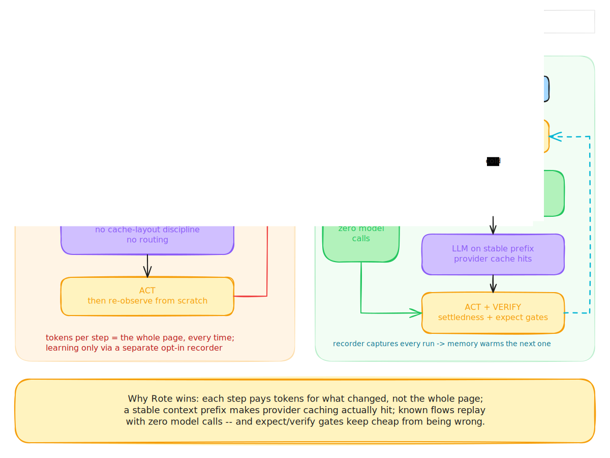
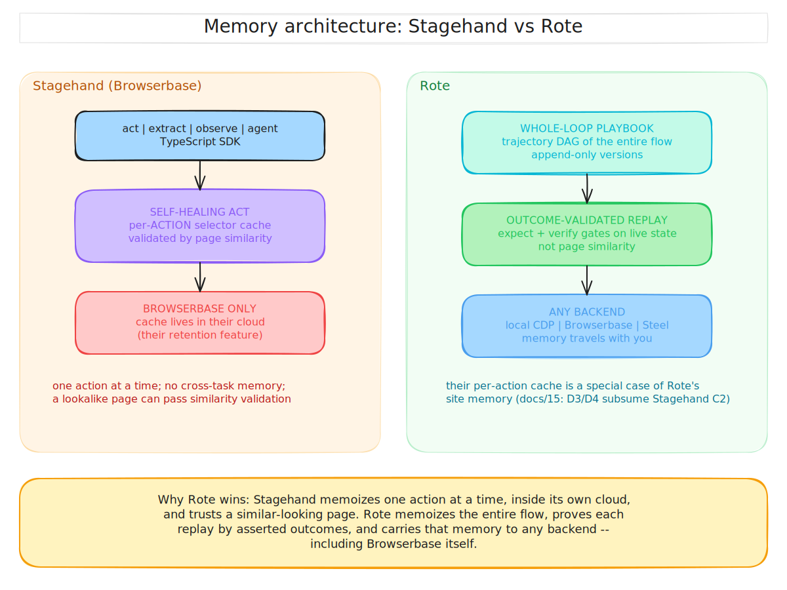
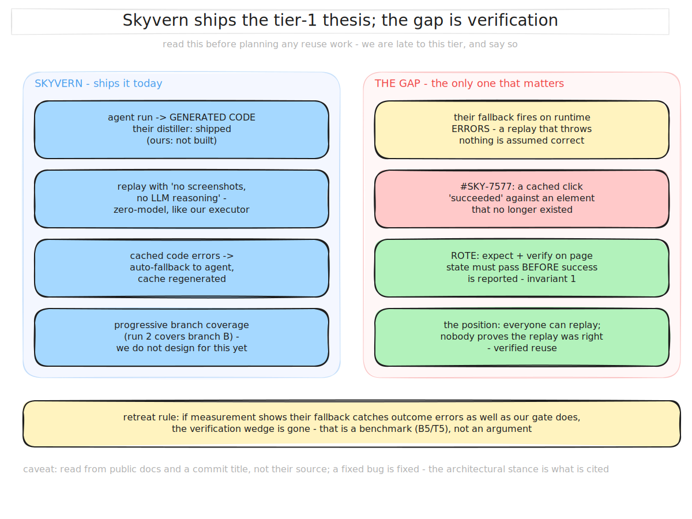
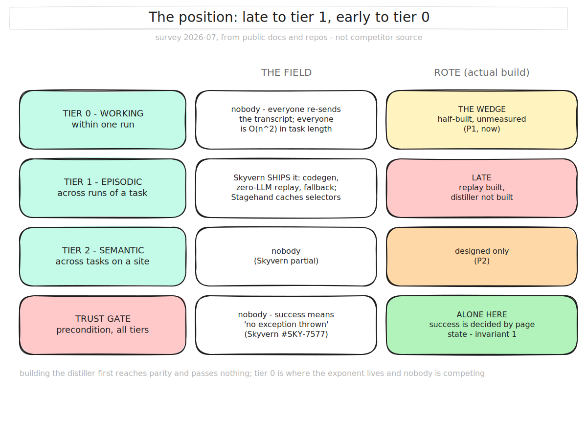

# 15 — Competitor Teardown: The Browser-Agent Field, 2026-07

> Status: survey. Supersedes [10](10-competitive-landscape.md)'s narrower question
> ("who memoizes?") now that Rote is a full agent system
> ([13](13-agent-system.md)). Optimization IDs (A1, C3, …) refer to
> [14 — Optimization Catalog](14-optimization-catalog.md).

## The field, mapped

Four strata. Rote competes in stratum 2, buys from stratum 1, runs models from
stratum 4, and adopts stratum 3.

```text
4. MODELS      GPT/CUA, Claude computer-use, Gemini/Mariner, Fara-7B, UI-TARS
3. STANDARDS   WebMCP (navigator.modelContext), MCP
2. HARNESSES   Browser Use, Stagehand agent, Skyvern, Magnitude, Notte, (Rote)
1. INFRA       Browserbase, Steel, Hyperbrowser, Anchor, Kernel, Browserless
```

## Stratum 2 — the harnesses (the direct competitors)

### Browser Use — the open-source default
- **What it is**: Python OSS harness, the community Schelling point; cloud offering on
  top; separate `workflow-use` product for record-and-replay ("RPA 2.0").
- **Efficiency stack**: strong **A1/A2** (their DOM engine: CDP-coordinated extraction,
  interactive-element detection with 95%+ re-walk cache hits, LLM-optimized
  serialization) — the best-documented distiller in OSS. Optional vision. Beyond
  perception: frontier-model-every-step loop, full re-observation per step (no A4
  diffs, no A6 signals), no routing (B1), no cache-layout discipline (B3), learning
  only via the separate, user-initiated workflow-use recorder (D2-ish, no D3/D4).
- **Read**: they won distribution, not architecture. Their DOM engine validates that
  perception quality matters; everything above the observation layer is conventional.
- **Rote vs**: match A1/A2 (table stakes), then win on A4/B2/B3/C3/D* which their
  architecture doesn't attempt. Their mindshare is the real moat — the counter is a
  reproducible head-to-head cost benchmark (F4/G1).



### Stagehand (Browserbase) — the SDK play
- **What it is**: TS SDK (`act`/`extract`/`observe`/`agent`), the developer-friendly
  wrapper over Browserbase infra; v3 with computer-use agent support.
- **Efficiency stack**: **C2** is their signature (self-healing `act`, resolved-selector
  caching with page-similarity validation — up to ~80% speedup on repeat runs;
  server-side act-result caching on Browserbase). Good DX for B5-style structured
  calls. No diffs, no routing, no speculation, no cross-task memory; caching is
  per-action and framework-locked (their cache is their retention feature).
- **Read**: the closest thing to a "cached actions" product, deliberately scoped to
  single actions. The agent loop itself is standard.
- **Rote vs**: their per-action cache is a special case of D3/D4; Rote's memory is
  whole-loop and infra-portable (E2 — including running *on* Browserbase). Expect them
  to move toward memory; speed matters.



### Skyvern — the vision-first workflow product
- **What it is**: OSS + commercial; vision-heavy planning (screenshots + prompts),
  workflow builder, enterprise focus (forms, portals, RPA replacement).
- **Efficiency stack**: the most efficiency-conscious incumbent: **code caching**
  (generates reusable code from successful runs; per-block caching; auto-fallback to
  the agent when cached code fails — a real D2 analog), **prompt splitting**
  (static/dynamic prompt separation for cache reuse — a partial B3), action-plan
  retrieval by URL+goal (weak D4). But the cold loop is vision-first (expensive —
  see A7 evidence: SoM/vision agents cost ~10× in output tokens), and learning is
  workflow-block-granular, not site-granular.
- **Read**: closest in *spirit* to Rote — they've independently arrived at
  record→cache→fallback. Their cost floor is set by vision-first perception.
- **Rote vs**: cheaper cold loop (a11y-first A1–A8, vision elective), finer-grained
  learning (D3/D4 below workflow granularity), verification contracts (C6/F1) they
  lack, speculation (C3) nobody has.



### Magnitude — the vision-native challenger
- **What it is**: OSS TS harness, vision-native (pixel coordinates, works on any
  rendered UI), deterministic-caching discussion stage.
- **Efficiency stack**: minimal today; the bet is that vision models get cheap/good
  fast and DOM parsing becomes legacy. Grounding via pixel coordinates sidesteps
  A1–A3 entirely (and gives up their benefits).
- **Rote vs**: opposite bet on perception economics. If vision token costs collapse,
  A7's "elective vision" posture adapts; Rote's learning/speculation planes are
  representation-agnostic either way.

### Notte & the long tail
Notte (perception-focused OSS harness: structured page "perception" maps), plus a
rotating cast of agent products (Induced, Twin, Runner H, Rtrvr, …). Individually
small; collectively they confirm the market's direction — perception compression and
reuse are where everyone's intuition points. None have the learning plane.

## Stratum 4 — the model-side agents (frame-setters, not direct competitors)

| Player | Loop | Efficiency posture | Cross-run learning |
|---|---|---|---|
| OpenAI Operator / CUA API | Screenshot → reason → act | Premium; latency-heavy; per-step vision | None published |
| Claude computer-use tool | Screenshot loop via tool use | Same shape; quality-led | None published |
| Google Mariner / Chrome integration | Browser-integrated | Unknown; distribution-led (Chrome) | Unknown; WebMCP alignment likely |
| Fara-7B / UI-TARS class | Screenshot-native small models | **The efficiency event**: near-frontier computer-use at 7B scale, on-device viable | N/A (models, not systems) |

Read: labs sell capability ceilings; small grounded models (Fara-class) are the
harness-builder's gift — they make B1 routing dramatic (frontier only for the hard
10%). A harness that treats models as swappable (B1) turns all of stratum 4 into
suppliers. The labs' agents lack cross-run learning entirely — the learning plane
(D*) is uncontested there.

## Stratum 1 — infra (partners, and one watch item)

Browserbase (polish/DX leader), Steel (open-source, self-hostable, fastest measured
control plane ~229ms), Hyperbrowser (volume/stealth/price), Anchor (auth/identity
focus), Kernel, Browserless. All sell: headed Chrome at scale, persistent
sessions/profiles (E3), proxies/stealth (E4), CDP/Playwright surfaces.

- **Posture**: E2 (backend-agnostic) makes them all supported runtimes. Steel's
  openness fits self-hosted enterprise; Browserbase fits managed polish.
- **Watch item**: Browserbase owns Stagehand — infra + harness verticalization. If
  harness-level memory/speculation appears anywhere first, it's likely there. Their
  incentive (sell browser-hours) slightly conflicts with latency optimization, which
  is quietly good for us: speculation *increases* useful utilization while cutting
  wall-clock; we can sell it as making their infra look faster.

## Stratum 3 — WebMCP (adopt, don't fight)

W3C Community Group spec (Google+Microsoft), Chrome 146+ origin trial, big-name site
experiments (Expedia, Shopify, Target…). When present, the site *is* the perception
plane (A9) at ~zero token cost. Years from ubiquity; the polyfill/auto-generation
niches are already taken (MCP-B, auto-webmcp, keak-ai). The harness-side opportunity —
being the loop that *prefers* WebMCP and degrades gracefully — is unclaimed. That's
A9, and it's cheap to be first.

## Capability matrix (vs the catalog)

Legend: ● ships it, ◐ partial/adjacent, ○ absent. (Rote column = designed target,
P0 set.)

| Optimization | Browser Use | Stagehand | Skyvern | Magnitude | Labs (CUA/Claude) | **Rote (target)** |
|---|---|---|---|---|---|---|
| A1/A2 DOM distillation + element detection | ● | ◐ (via `observe`) | ◐ (vision-first) | ○ (pixels) | ○ (pixels) | ● |
| A3 stable element IDs | ◐ | ○ | ○ | ○ | ○ | ● |
| A4 diff observations | ○ | ○ | ○ | ○ | ○ | ● |
| A7 elective vision (SoM) | ◐ | ◐ | ● (always-on) | ● (always-on) | ● (always-on) | ● (elective) |
| A8 token budget contract | ○ | ○ | ○ | ○ | ○ | ● |
| A9 WebMCP-first | ○ | ○ | ○ | ○ | ◐ (Mariner?) | ● |
| B1 model routing | ○ | ◐ (model per call) | ◐ | ○ | ○ | ● |
| B2 no-model replay | ◐ (workflow-use, separate) | ◐ (action cache) | ● (code cache) | ◐ (discussed) | ○ | ● (+verified) |
| B3 cache-layout discipline | ○ | ○ | ◐ (prompt split) | ○ | n/a | ● |
| C1 settledness detection | ◐ | ◐ | ◐ | ◐ | ○ | ● |
| C2 self-healing resolution | ◐ | ● | ◐ | n/a | n/a | ● (+memory-ranked) |
| C3 speculative execution | ○ | ○ | ○ | ○ | ○ | ● |
| C6/F1 assertion-gated verification | ○ | ○ | ◐ (fallback ≠ verify) | ○ | ○ | ● (invariant) |
| D1 lossless always-on recording | ○ | ○ | ◐ | ○ | ○ | ● (built) |
| D3/D4 site memory + prediction | ○ | ○ | ◐ (plan retrieval) | ○ | ○ | ● |
| E2 infra-agnostic backends | ◐ | ○ (Browserbase) | ◐ | ◐ | ○ | ● |
| G1 per-source cost accounting | ○ | ○ | ◐ | ○ | ○ | ● (built) |

The matrix's empty columns are the strategy: **A4, C3, B3, D3/D4, and C6-as-invariant
have no incumbent.** Everything with a ● in a competitor column is table stakes to
match, not differentiation to chase.



## Honest steelman (what could make this analysis wrong)

1. **Browser Use ships diffs + memory in a quarter.** Their DOM engine gives them
   A3→A4 cheaply. Mitigation: speed + the verification/learning planes are a deeper
   stack than a diff feature; benchmark early and loudly.
2. **Vision economics flip** (Fara-class at ~0 cost): A1–A8's advantage compresses.
   Mitigation: the decision/learning/action planes are representation-independent;
   B1 routing means Rote rides the same cost collapse.
3. **WebMCP wins faster than expected**: perception differentiation shrinks for big
   sites. Mitigation: A9 makes that our best case, not our obsolescence — and the
   long tail of sites will be DOM-only for many years.
4. **Skyvern's enterprise motion outruns architecture**: they sell outcomes, not
   loops. Mitigation: their customers' bills are our benchmark targets.

Next: [16 — Harness Architecture](16-harness-architecture.md)
