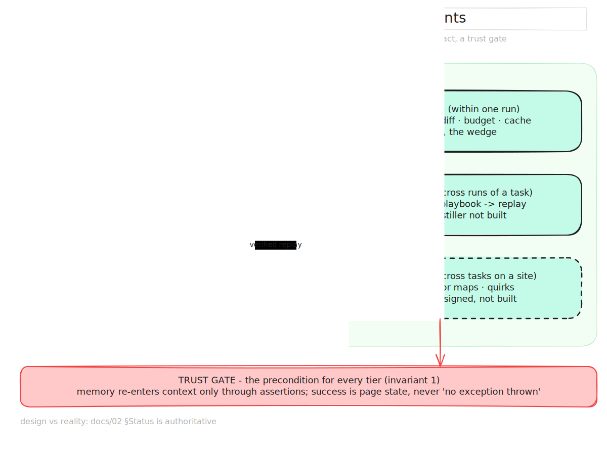

# Rote — Efficiency-First Browser Agent

> **The browser agent that gets cheaper as it learns a site.**

Rote is a browser-agent harness built around efficiency: compact observations, stable
element IDs, diff-based perception, cache-friendly context, verified replay, and a
learning plane that turns prior runs into site memory. The original record/replay system
remains the safety foundation; the current product direction is the full agent system in
[13 — The Rote Agent System](13-agent-system.md).

## The efficiency stack in one table

| Plane | Baseline browser-agent cost | Rote's answer |
|---|---|---|
| Perception | Large DOM/a11y/screenshot observations every step | distilled trees, stable IDs, diffs, hard budgets |
| Decision | frontier model on every step | cache-local context, routing, no-model replay where safe |
| Action | serialized think → act → observe loop | settledness, self-healing resolution, speculative execution later |
| Learning | every run starts cold | recorded trajectories → playbooks, site memory, transition models |

V1 launches on the deterministic pieces — cheaper observations, context layout, recording,
and verified replay — with speculation and learned site memory following after the first
public benchmark.

## Docs

| Doc | Contents |
|---|---|
| [01 — Problem](01-problem.md) | The reuse-path gap: read path (compression) and write path (Mem0/Zep) are crowded; nobody owns replay |
| [02 — Architecture](02-architecture.md) | Recorder → Distiller → Playbook Store → Matcher → Replay Executor → Repair ladder; failure-safety invariants |
| [03 — Wedge Benchmark](03-wedge-benchmark.md) | "Run it twice": task suite, metrics, kill thresholds, 90-second demo script |
| [04 — Market](04-market.md) | Competitive map, three steelmanned objections, buyers, why now |
| [05 — Roadmap](05-roadmap.md) | Phase 0 gate → OSS release → control plane; open questions |
| [06 — Build Plan](06-build-plan.md) | Milestone-by-milestone execution: tasks, automated + manual tests, exit/kill gates |
| [07 — Browser-Agent Fit](07-where-rote-works.md) | Browser-agent fit guide: site memory, replay, weak-fit browsing tasks |
| [08 — Browser Memory Architecture](08-browser-memory-architecture.md) | Three memory tiers (playbook / subflow / site memory), replay vs advisory modes, build order |
| [09 — Generalization Evaluation](09-generalization-evaluation.md) | Learning-curve benchmark, transfer matrix T0–T5, kill gates for the generalization thesis |
| [10 — Competitive Landscape](10-competitive-landscape.md) | Who memoizes browser agents today (Stagehand, Skyvern, workflow-use, AWM) and the gaps Rote targets |
| [11 — Speculative Execution](11-speculative-execution.md) | Overlapping model thinking with browser acting: memory-driven prediction, shadow sessions, commit gates, observation diffs |
| [12 — Implementation Path](12-implementation-path.md) | How the existing packages become the doc-11 design: reuse map, proxy refactor, milestones M4–M9 with kill gates |
| [13 — The Rote Agent System](13-agent-system.md) | Direction of record: Rote as a full efficiency-first browser-agent system; the four-plane architecture; positioning |
| [14 — Optimization Catalog](14-optimization-catalog.md) | The master inventory: every optimization an efficient browser-agent system needs, with evidence, incumbents, and P0–P2 tiers |
| [15 — Competitor Teardown](15-competitor-teardown.md) | Per-competitor analysis (Browser Use, Stagehand, Skyvern, Magnitude, labs, infra) and the capability matrix |
| [16 — Harness Architecture](16-harness-architecture.md) | Component-level design: packages, type spine, the control loop, perception pipeline, routing, build order H1–H8 |
| [17 — V1 Launch Plan](17-v1-launch-plan.md) | The six-week launchable subset: in/out scope, weekly gates, the launch number, checklist |
| [18 — Product Roadmap](18-product-roadmap.md) | The full timeline P0–P5: phase goals, workstreams, exit/kill gates, dependency spine, scope fences |

## Diagrams

- [`diagrams/architecture.svg`](diagrams/architecture.svg) — four-plane system overview, with implemented vs planned boundaries
- [`diagrams/package-map.svg`](diagrams/package-map.svg) — current package dependency map and target harness composition
- [`diagrams/perception-pipeline.svg`](diagrams/perception-pipeline.svg) — capture, distillation, diffing, budget, and vision escalation
- [`diagrams/run-lifecycle.svg`](diagrams/run-lifecycle.svg) — cold / warm / drift economics
- [`diagrams/repair-ladder.svg`](diagrams/repair-ladder.svg) — self-healing state machine

Every SVG has a same-name editable `.excalidraw` source. Regenerate exports with
`node docs/diagrams/generate.mjs` after changing the source model.

## Design invariants (the short list)

1. **Never silently wrong** — every replayed step is assertion-gated.
2. **Never worse than baseline** — full-agent fallback always exists.
3. **Never cross environments** — structural fingerprints are a hard gate.
4. **Everything versioned** — playbooks and repair patches are append-only, auditable, diffable.
