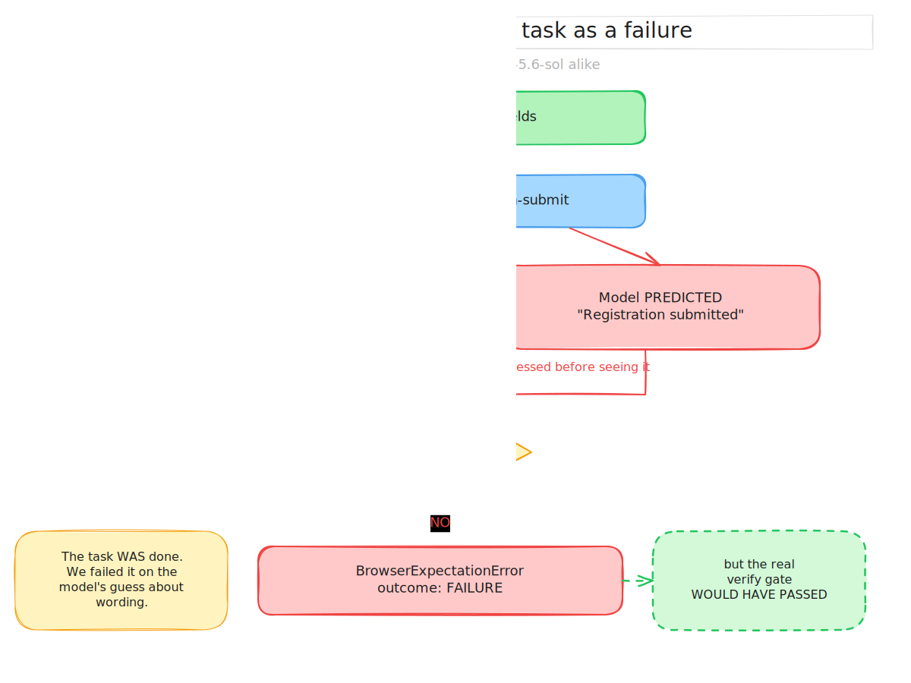

# T1 — First live run: B1–B3 on a real OpenAI key

| | |
|---|---|
| **Date** | 2026-07-15 |
| **Subject** | Does Rote actually complete the frozen B1–B3 fixture tasks, end to end, with a real model and a real browser? |
| **Verdict** | **B1 pass, B3 pass, B2 fail 0/7.** The harness works. B2 fails on a design flaw in mandatory action `expect`, not on capability. |
| **Issues raised** | [#49](https://github.com/kedarvartak/rote/issues/49) · [#50](https://github.com/kedarvartak/rote/issues/50) · [#51](https://github.com/kedarvartak/rote/issues/51) · [#52](https://github.com/kedarvartak/rote/issues/52) |
| **Cost** | Under \$0.10 total |

## Why we ran it

Everything up to this point was fake-world. The deterministic suite was green, the
benchmark machinery was complete (#40–#42), and `docs/05` W5 was one command away
from producing "the number". Before spending a 108-run matrix (3 tasks × 18
repetitions × 2 harnesses) we wanted the cheapest possible answer to a question no
unit test can answer: **does any of this work against a real browser and a real
model?**

The plan was one `rote run` on B1. It went further than expected, and then it
stopped being about B1.

## Environment

| | |
|---|---|
| Rote | `485e264` (main, after #48) |
| Provider | OpenAI via `ROTE_LLM_PROVIDER=openai` (`@rote/llm` Responses API path) |
| Models | `gpt-5.6-luna` (\$1/\$6 per MTok), `gpt-5.6-sol` (\$5/\$30 per MTok) |
| Browser | Chromium `/usr/bin/chromium-browser`, launched via `LaunchingCdpBrowserBackend` |
| Fixtures | `fixtures/sites/{b1-report,b2-vendor-form,b3-catalog}.html`, served by `scripts/bench/headhead/serve-fixtures.mjs` on `127.0.0.1:8080` |
| Artifacts | `.rote/runs/<run_id>/{manifest.json,trajectory.jsonl}` |

## Method

Fixture server, then one run per task, verbatim:

```bash
node scripts/bench/headhead/serve-fixtures.mjs 8080 &
set -a; . ./.env; set +a

node packages/cli/bin/rote.js run \
  'Sign in to the reports portal with username "analyst" and password "s3cret", then download the latest report.' \
  --url http://127.0.0.1:8080/b1-report.html \
  --verify-text "Report download complete: quarterly-report.pdf" \
  --model gpt-5.6-luna --max-steps 12
```

B2 and B3 used the same shape with their own prompt / URL / verify text, taken from
`scripts/bench/headhead/tasks.json` so the run matched what the benchmark would do.

For the B2 investigation we drove `runBrowserTask` directly in a loop, so we could
catch the thrown error object rather than only the CLI's one-line message:

```ts
try { const r = await runBrowserTask({ task, url, verifyText, model, maxSteps: 20, chromePath }); }
catch (e: any) {
  console.log(`THREW ${e.name}: ${e.message}`);
  if (e.output) console.log(`raw model output: ${e.output}`);  // BrowserPlannerOutputError carries this
}
```

## Results

| Task | Model | Runs | Outcome | Tokens (in+out) | Steps |
|---|---|---|---|---|---|
| B1 login → download | luna | 1 | pass (verified) | 2,413 + 313 | 5 |
| B3 search → open | luna | 1 | pass (verified) | 1,743 + 323 | 4 |
| B2 8-field form | luna | 4 | fail 0/4 | — | died mid-run |
| B2 8-field form | **sol** | 3 | fail 0/3 | ~6,879 + 682 per run | died mid-run |

### B1 and B3 genuinely work

B1's recorded trajectory:

```
0. browser.fill   #username                 → "analyst"
1. browser.fill   #password                 → "s3cret"
2. browser.click  #login-submit
3. browser.click  #latest-report-download
4. browser.done   success: true
```

Four actions — the **physical minimum** for B1 — plus `done`. The manifest carries
five `planner`-tagged usage entries summing exactly to the reported 2,413+313, so
the accounting is real and traceable, not a display total.

Both successes are meaningful because the final `--verify-text` gate is
falsifiable: `"Report download complete: quarterly-report.pdf"` and
`"Alpha product opened"` only appear *after* the task is truly done.

### B2 fails 0/7 — and the failing run had completed the task



A `gpt-5.6-sol` B2 run, recorded `outcome: failure`:

```
0. fill   #company-name        Northwind Supply     expect={"input_value": ...}   ok
1. fill   #contact-email       ap@northwind.test    expect={"input_value": ...}   ok
2. fill   #tax-id              84-1129930           expect={"input_value": ...}   ok
3. fill   #address-line1       18 Harbor Way        expect={"input_value": ...}   ok
4. fill   #city                Portland             expect={"input_value": ...}   ok
5. fill   #postal-code         97209                expect={"input_value": ...}   ok
6. select #country             US                   expect={"input_value": ...}   ok
7. fill   #phone               503-555-0148         expect={"input_value": ...}   ok
8. click  #registration-submit                      expect={"text_visible": "Registration submitted"}   FATAL
```

All eight fields correct. The run died because the model's **predicted**
confirmation text did not match the page's actual text.

The invented strings, across seven attempts:

| Model | Guess |
|---|---|
| luna | "Vendor registered successfully" |
| luna | "Registration successful" |
| luna | "Vendor registered successfully" |
| sol | "Vendor registration submitted" |
| sol | "Registration submitted" |
| sol | "Registration submitted" |

The page says **"Vendor registration complete"**. Every guess is *reasonable*; none
is right.

### Proof it is a false negative

We replayed exactly the actions the `sol` run performed, through CDP, and captured
the resulting page:

```
After exactly the actions the sol run performed, the page shows:
  our real --verify-text  "Vendor registration complete" -> true
  the model's guess       "Registration submitted"       -> false
```

**The run would have passed final verification.** The task was done. We recorded a
failure because of a guess about wording.

### The flagship model does not help

`gpt-5.6-sol` costs 5× luna and took 60–84 s per run versus a few seconds. It failed
identically, 3/3. This is the load-bearing result of T1: **the failure is not a
capability gap that a bigger model closes.** The confirmation string is not
derivable from anything the model can see before it acts.

### Second failure mode: malformed `stableId`

One of the seven B2 attempts died differently:

```
"code": "too_big", "maximum": 16, "exact": true,
"message": "String must contain exactly 16 character(s)", "path": ["stableId"]
```

`BrowserActionSchema` requires `stableId` to be exactly 16 chars — but the field is
**optional**, and `packages/perception/src/distill.ts:91` generates ids as
`sha256Hex(...).slice(0, 16)`, always exactly 16. So the constraint can *never*
reject a real id; it only ever fires on one the model invented. The action also
carried a valid `selector`. The whole run ended anyway.

## What we found out

1. **The core harness is real.** Chromium launch, CDP, perception, stable IDs,
   the OpenAI tagged-client path, action execution, append-only recording, and
   per-source token accounting all work end to end against a live model. This was
   the primary question and the answer is yes.
2. **B1 is essentially optimal** — 4 actions, ~2.7K tokens, no wasted exploration.
3. **B2 is unrunnable as designed**, and the cause is ours, not the model's.
4. **The passing expects are mostly vacuous.** Reading what the model chose:
   - `input_value` echoes the value the model itself just typed — it cannot fail.
   - B1's `text_visible: "Download latest report"` is the **button's own label**,
     on screen *before* the click. It passes even if the click does nothing.
   - The only falsifiable expect in the whole test (B2's confirmation) is the one
     that killed a successful run.

   So the mechanism **passes when trivially true and fails when precise.**
5. **There is no recovery anywhere.** A schema violation or a failed expect throws
   and ends the run. `BrowserPlannerOutputError` even captures the raw model output
   — the exact material needed to re-prompt — and nothing reads it.

## Conclusion

**Invariant 1 held perfectly.** Nothing ever reported success on a failed check;
B2 failed loudly. The safety design works.

But safety was never the question T1 asked. The capability answer is that Rote
currently **cannot complete B2 at all**, and would report ~0% success on it at
benchmark scale — while Browser Use, which does not demand predicted
postconditions, would likely pass. **We would lose the W5 launch gate on our own
design choice rather than on efficiency.**

That is the finding: the harness is sound, one design decision is not, and it is
the decision that turns a working agent into a failing benchmark row.

## What needs to change

Ordered by how much they block the number:

| # | Change | Why it blocks W5 |
|---|---|---|
| [#49](https://github.com/kedarvartak/rote/issues/49) | Stop asking the model to predict unseen text; prefer structural/diff-derived postconditions | B2 is 0/7 without it |
| [#51](https://github.com/kedarvartak/rote/issues/51) | Bounded re-plan on invalid output / failed expect, tagged `repair` | Turns stochastic slips into recorded failures |
| [#52](https://github.com/kedarvartak/rote/issues/52) | Malformed *optional* `stableId` should degrade to the resolution fallback chain | Kills whole runs for a formatting slip |
| [#50](https://github.com/kedarvartak/rote/issues/50) | Make expects mean something where they pass | Safety story currently overstated |

**Do not run the full matrix until #49 lands.** It would buy ~36 expensive B2 false
negatives and a number we would have to throw away.

The fix is **not** to weaken verification. The final `verify` gate is what makes
B1/B3's successes real and must stay exactly as strict. The problem is asking a
model to assert something it cannot know.

## Notes on how this test was run (including our mistakes)

Recorded because they cost time and would cost it again:

- **We leaked the API key into the session transcript.** A preflight line used
  `${OPENAI_API_KEY:+set, ${#OPENAI_API_KEY} chars}${OPENAI_API_KEY:-<unset>}`
  intending an either/or. `${VAR:-default}` prints **the value** when the variable
  is set, so the key was printed in full. The key was rotated immediately. Use only
  the `:+` branch, which can never expand to the value:
  `echo "OPENAI_API_KEY = ${OPENAI_API_KEY:+set (${#OPENAI_API_KEY} chars)}"`.
- **`tail -6` hid the real error.** The first B2 failure looked like a
  verification failure; the actual Zod error was further up. Read the whole error
  before theorising.
- **A first attempt to prove the regression test worked proved nothing** — it
  stashed the test along with the fix. Verify a test fails by reverting *only* the
  fix.
- **`runBrowserTask` does not read `ROTE_BASE_DIR`** — the CLI does, and passes
  `baseDir`. Probes that call it directly write to `./.rote` (gitignored).
- **`pgrep -f serve-fixtures` matches its own command line**, so it reports the
  server as running after it has stopped. Check the port instead.

## Reproduction

```bash
git checkout 485e264
cp .env.example .env      # set ROTE_LLM_PROVIDER=openai, OPENAI_API_KEY, CHROME_PATH
set -a; . ./.env; set +a
node scripts/bench/headhead/serve-fixtures.mjs 8080 &

# B1 — expect success
node packages/cli/bin/rote.js run \
  'Sign in to the reports portal with username "analyst" and password "s3cret", then download the latest report.' \
  --url http://127.0.0.1:8080/b1-report.html \
  --verify-text "Report download complete: quarterly-report.pdf" \
  --model gpt-5.6-luna --max-steps 12

# B2 — expect failure on a hallucinated expect, on any model
node packages/cli/bin/rote.js run \
  'Register a vendor with company name "Northwind Supply", contact email "ap@northwind.test", tax ID "84-1129930", address line 1 "18 Harbor Way", city "Portland", postal code "97209", country "US", and phone "503-555-0148", then submit the registration.' \
  --url http://127.0.0.1:8080/b2-vendor-form.html \
  --verify-text "Vendor registration complete" \
  --model gpt-5.6-luna --max-steps 20
```

B2's exact failure is stochastic (usually the expect, occasionally `stableId`), so
run it a few times to see both modes.

## Outcome (added 2026-07-16)

T1's primary finding is **fixed** (#49/#50). The record above is left as written — it is
the log of what we measured on 2026-07-15, not a live status page.

What the fix changed, and one thing T1 got wrong:

- **`expect` is now optional.** The planner is asked to omit rather than guess. On live
  re-runs it omitted on *every* action of B1, B2 and B3 — so the tautological
  `input_value` expects (#50) vanished at the same time. Both failure shapes were
  symptoms of a mandatory field with nothing true to put in it.
- **A failed expect costs one scoped repair, not the run.** T1's own trace showed why the
  repair must not replay the action: on B2 the submit had *already landed*: only the
  belief about it was wrong.
- **T1's proposed fix #1 was wrong.** It suggested preferring structural expects, on the
  grounds that `selector_visible: "#registration-confirmation"` is "checkable from the
  observation the model already has". It is not. That section is `hidden` until submit
  and the distiller drops hidden nodes, so the id never reaches the model either.
  Structural expects would have moved the guess from a string to an id, not removed it.
  The post-click state was not expressible in **any** primitive of the DSL.

Re-measured on the same frozen fixtures, same prompts, same two model tiers:

| Task | T1 (2026-07-15) | After #49 | Tokens |
|---|---|---|---|
| B1 | pass 1/1 | pass 1/1 | 2726 → 2750 (+0.9%) |
| B3 | pass 1/1 | pass 1/1 | 2066 → 2048 (**−0.9%**) |
| B2 | fail **0/7** | pass **11/11** | — (was unmeasurable: no run finished) |

B3 got *cheaper*: the output tokens saved by not emitting `expect` more than paid for the
prompt guidance that asks for omission. The reproduction commands above still apply — at
`ac58573` they fail as recorded; on `main` they pass.

## References

- `docs/05-roadmap.md` W4 (action plane, live expect checks), W5 (the gate)
- `docs/03-benchmark.md` (success parity; publish method and raw data)
- `CLAUDE.md` invariant 1 (never silently wrong) — upheld throughout
- Touch points: `packages/agent/src/types.ts`, `packages/agent/src/tagged-llm-planner.ts`, `packages/action`
